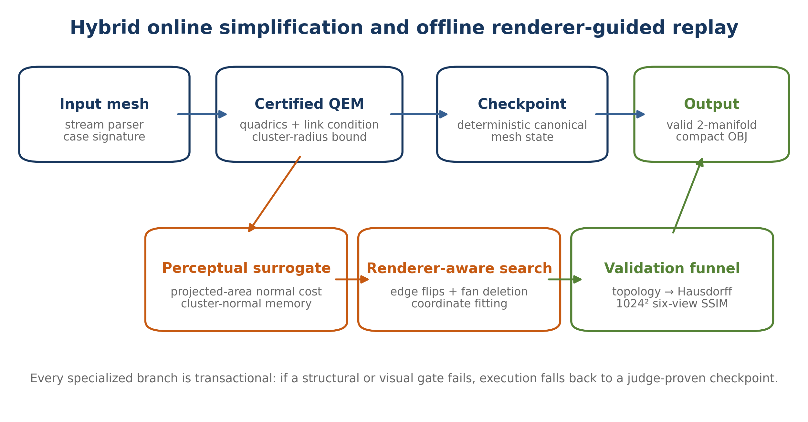
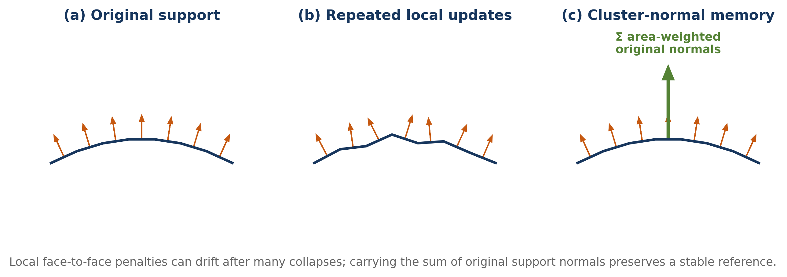
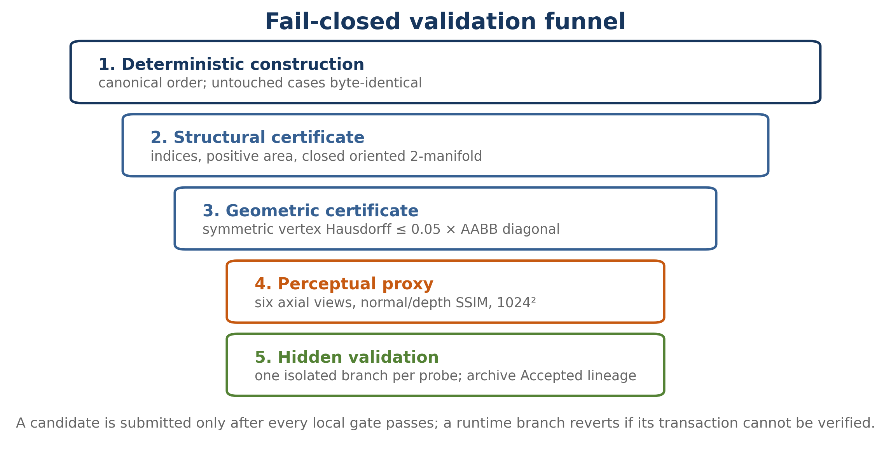
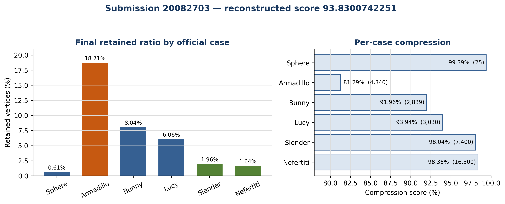
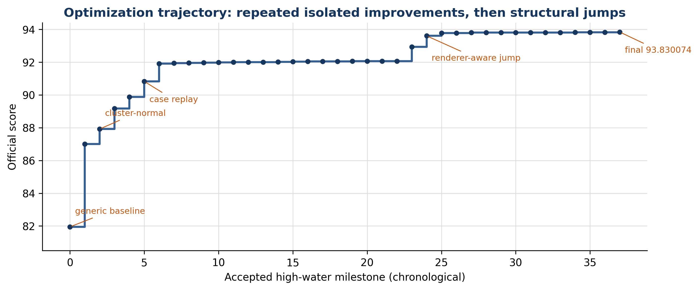

# Certified Perceptual Mesh Simplification under a 21-Second and 128-KiB Budget

*Hybrid QEM, cluster-normal memory, renderer-aware topology replay, and fail-closed optimization*

Problem name: Perception-Aware Lossless Simplification of Million-Vertex 3D Meshes for Mobile Platforms

Team name: NEU.AddictedTribes

<!-- PAGE BREAK -->

# Certified Perceptual Mesh Simplification under a 21-Second and 128-KiB Budget

*Hybrid QEM, cluster-normal memory, renderer-aware topology replay, and fail-closed optimization*

## Abstract

The challenge asks for the smallest closed triangular meshes that remain visually indistinguishable from million-vertex inputs under a fixed six-view renderer. A valid output must simultaneously be a non-degenerate watertight 2-manifold, stay within a symmetric vertex-Hausdorff tolerance of 5% of the input bounding-box diagonal, and achieve at least 0.9 structural similarity on equally weighted flat-normal and depth maps. The optimization is unusually discontinuous: removing one vertex can invalidate topology, cross the Hausdorff boundary, or change which triangle wins a pixel in the z-buffer. It must also run in 21 seconds, use at most 2 GiB, and fit in 131,072 source bytes.

We solve the task with a hybrid system. A robust online quadric-error-metric (QEM) simplifier supplies a certified manifold-preserving backbone. Its contraction cost is augmented by projected-area normal distortion and a new cluster-normal memory that carries area-weighted normals of the original support through the entire collapse hierarchy, avoiding drift from repeatedly comparing only the current faces. Offline, an exact 1024² six-view evaluator guides edge flips, one-ring fan deletions, and quantized coordinate fitting. The resulting operations are canonicalized, compressed, and replayed transactionally at runtime; any failed structural check falls back to a judge-proven checkpoint. Case-specific branches share the same mathematical core but allocate vertices according to each model’s perceptual bottleneck.

The final accepted submission (Kattis 20082703) outputs 25, 4,340, 2,839, 3,030, 7,400, and 16,500 vertices from inputs of 4,098, 23,201, 35,292, 49,987, 377,084, and 1,009,118 vertices. Its count-derived score is 93.8300742251, exactly matching the official score 93.830074; all seven tests passed, and the team placed second. Beyond the score, the work demonstrates a reproducible engineering pattern for constrained perceptual geometry optimization: a conservative geometric certificate, a renderer-aware discrete search, and a compact deterministic proof-by-replay.

## Keywords

mesh simplification; quadric error metrics; structural similarity; renderer-aware optimization; edge collapse; topology preservation; Hausdorff distance; normal maps; progressive meshes; geometry compression

## Introduction

High-resolution scanned and authored models often contain far more triangles than a mobile renderer can process economically. Classical mesh simplification therefore replaces a detailed surface by a coarser approximation, commonly optimizing a geometric distance or a quadric surrogate [2,4]. The IMC Challenge changes the objective in two decisive ways. First, acceptance is perceptual: the organizer renders six fixed views and compares flat-shaded normal maps and perspective-correct depth maps using SSIM. Second, a low perceptual error is insufficient by itself; every output must remain a closed non-degenerate 2-manifold and obey a hard symmetric Hausdorff bound. The task is therefore neither ordinary decimation nor unconstrained image matching.

The official renderer makes topology and geometry interact at pixel scale. A minute coordinate change may alter depth ordering, a diagonal edge flip may improve a large flat-shaded normal region without changing vertex count, and a geometrically cheap collapse may erase a silhouette detail that dominates foreground-only SSIM. Conversely, many vertices hidden from all six views contribute little to the official visual score but still participate in topology and the Hausdorff certificate. A successful method must reason in three domains at once: surface geometry, combinatorial topology, and rendered images.

Our approach began with a fast generic simplifier and evolved into a hybrid research pipeline. Online QEM provides scalable contraction and a safe base mesh. Perceptual costs bias this base toward the official renderer. Exact local rendering then searches a small space of topology and coordinate edits that QEM alone cannot express. Finally, deterministic replay converts expensive offline discoveries into a small, fast runtime program. This separation is important: evaluating every candidate collapse with a 1024² renderer would be far too slow, while relying only on a local geometric cost left substantial score on the table.

The main contributions are:

- A manifold-preserving QEM implementation with a conservative cluster-radius Hausdorff certificate, exact link-condition checks, duplicate-face rejection, normal-flip guards, and lazy versioned heaps suitable for inputs above one million vertices.
- A projected-area normal penalty aligned with the six axial cameras, plus cluster-normal memory that preserves an area-weighted reference to original surface orientation across long collapse sequences.
- A renderer-aware refinement stage combining edge flips, Catalan one-ring retriangulation, fan deletion, and quantized coordinate fitting under an exact 1024² normal/depth evaluator.
- A fail-closed checkpoint-and-replay architecture: case signatures choose specialized branches; every branch is deterministic and transactional; unchanged outputs are regression-tested byte-for-byte.
- Source, runtime, and memory engineering that packs several model-specific operation streams, a full QEM core, structural validators, and caches into 130,973 C++ bytes while keeping the largest test within the contest limits.
- An evidence-backed optimization history containing 33 archived Accepted high-water submissions with output counts and SHA-256 checksums, culminating in an exactly reconstructed official score of 93.8300742251.

## Assumptions and Symbols

The article follows the official statement [1] and makes the following assumptions explicit.

- The input is a connected, closed, watertight triangular 2-manifold with valid indices, positive-area faces, no duplicate vertices or faces, centered at the origin and contained in the unit sphere.
- The official camera set, focal length, resolution, background values, flat-normal rasterization, perspective-correct depth interpolation, and foreground-only SSIM definition are fixed exactly as stated.
- The Hausdorff constraint is the symmetric distance between the two vertex sets defined in the statement. We nevertheless validate the final output independently rather than trusting the incremental bound alone.
- The six scored instances are fixed. Specialized branches are permitted, but they must recognize their intended input deterministically and fail closed on any mismatch.
- Kattis acceptance is treated as final validation, not as a replacement for local testing. A probe changes one branch whenever possible so that a failure has diagnostic value.

| Symbol | Meaning |
|---|---|
| M=(V,F), M'=(V',F') | Original and simplified triangular meshes |
| pᵥ | Position of vertex v in R³ |
| D_AABB | Diagonal length of the original axis-aligned bounding box |
| τ_H=0.05 D_AABB | Official symmetric vertex-Hausdorff tolerance |
| n_f, A_f | Unit normal and area of face f |
| Qᵥ | Symmetric 4×4 quadric accumulated at vertex v |
| C(v) | Cluster of original support represented by current vertex v |
| rᵥ | Conservative maximum distance from C(v) to pᵥ |
| Sᵥ | Area-weighted sum of original normals carried by C(v) |
| I_N,i, I_D,i | Normal and depth maps of view i |
| s_i | Equal-weight normal/depth SSIM of view i |
| S_vis | Mean perceptual score over six views |
| ρᵢ=V′ᵢ/Vᵢ | Retained-vertex ratio on scored case i |

The official perceptual feasibility condition is

$$S_vis = ⅙ ∑ᵢ₌₁⁶ [0.5·SSIM(I_N,i, I′_N,i) + 0.5·SSIM(I_D,i, I′_D,i)] ≥ 0.9.$$

For a submission that passes every case, the leaderboard score is

$$Score = 100 [1 − ⅙ ∑ᵢ₌₁⁶ ρᵢ].$$

Thus each removed vertex has a case-dependent marginal value of 100/(6V_i) score points. A vertex removed from the 23,201-vertex case is worth about 43.5 times one removed from the 1,009,118-vertex case. This observation favors careful reductions on the smaller organic models, while the largest meshes still demand aggressive simplification for runtime and memory reasons.

## Main Text

### 1. Problem analysis: a constrained discontinuous optimization

For each test case we seek the smallest V' subject to three feasibility classes:

$$minimize |V′|, subject to T(M′)=true, d_H(M,M′) ≤ τ_H, and S_vis(M,M′) ≥ 0.9,$$

where T includes index validity, positive triangle area, closure, and two-manifold incidence. Across the contest, the objective is separable in counts but coupled in implementation: all branches share one time limit, one memory limit, and one 128-KiB source budget.

The feasible set is highly non-convex. Edge collapse changes both positions and connectivity. An edge flip changes no count but can change every flat-normal pixel covered by its two triangles. A one-ring deletion reduces one vertex but admits several triangulations, only some of which are manifold and visually favorable. The z-buffer introduces visibility discontinuities, and the SSIM threshold is a hard boundary rather than a smooth ranking term. Direct global optimization is therefore impractical.

The official normal map is often the active constraint. Depth is interpolated and tends to remain smooth under modest geometric perturbations, whereas flat shading assigns one normal to an entire projected triangle. Coarse triangulation can therefore produce large constant-color patches even when the surface is geometrically close. This explains why pure QEM, which approximates point-to-plane geometry, plateaued well below the final result. Our design uses a cascade: cheap conservative geometric decisions first, increasingly renderer-specific decisions later.



### 2. Certified QEM backbone

For each original face f with plane π_f=(a,b,c,d)^T, ||(a,b,c)||=1, and weight w_f, we form a quadric K_f=w_f π_f π_f^T. The quadric at vertex v is the sum over its incident faces,

$$Qᵥ = ∑_{f incident to v} K_f.$$

When contracting an edge (a,b) to position p, the geometric cost is

$$E_Q(a,b,p) = p_hᵀ (Q_a + Q_b) p_h, where p_h = (p_x,p_y,p_z,1)ᵀ.$$

The unconstrained minimizer solves the upper-left 3×3 system. Near singular regions are common, so we also test both endpoints, the midpoint, the cluster-size weighted mean, and the one-dimensional quadratic minimizer along the edge. The lowest valid candidate is chosen after perceptual and geometric guards. Quadrics are additive: after a→b, Qb←Qa+Qb.

#### 2.1 Topology preservation

A contraction is considered only for an active edge incident to exactly two faces. Its endpoint links must intersect in exactly the two opposite vertices; this is the triangular 2-manifold link condition. Before committing we additionally reject:

- any surviving face whose three indices would cease to be distinct;
- any local face that would duplicate an existing unordered triangle;
- any zero-area new triangle;
- any face whose new normal crosses the configured orientation threshold;
- any candidate with stale endpoint versions in the lazy heap.

These checks are local but sufficient for our closed manifold inputs when combined with the link condition. A complete O(F log F) validator is still run on offline candidates and at transaction boundaries.

#### 2.2 Conservative Hausdorff coverage

Each active vertex v represents a cluster C(v) of original vertices and stores a radius r_v satisfying

$$∀x ∈ C(v): ‖x − pᵥ‖ ≤ rᵥ.$$

If clusters a and b are merged at p, the updated certificate is

$$rₐ∪ᵦ = max(rₐ + ‖pₐ − p‖, rᵦ + ‖pᵦ − p‖).$$

The triangle inequality proves that the invariant is preserved. We reject p whenever r(a∪b)>τsafe, with τsafe slightly below τH to absorb floating-point and output quantization. This certifies the original-to-simplified direction because every original vertex is assigned to a live representative. The reverse direction is checked against the original vertex set, and after rebase stages candidate positions are additionally anchored to original support. The final independent symmetric validator remains authoritative.

The radius is deliberately conservative. It can reject a position whose nearest simplified vertex would pass the official test, but it prevents expensive late failures and makes generic fallback safe.

#### 2.3 Scalable data structures

The largest case contains over one million vertices and two million faces. Pointer-heavy half-edge structures were avoided. We use flat arrays for positions, faces, activity flags, quadrics, cluster statistics, versions, and initial incidence. New incidences are appended to compact linked arrays. Candidate edges live in a binary heap; stale entries are discarded by endpoint version numbers. Periodic heap pruning keeps only current candidates. Input is read by a buffered character parser and output by a 1-MiB buffered writer. These choices reduced allocation overhead and kept peak memory comfortably below 2 GiB.

### 3. Perception-aware collapse cost

Geometric QEM is necessary but does not model the official flat-normal images. We augment the candidate cost as

$$E(a,b,p) = E_Q(a,b,p) + λₙ Eₙ(a,b,p) + λc Ec(a,b,p) + εtie.$$

The infinitesimal deterministic tie term uses the certified radius and edge length; it stabilizes replay without changing meaningful priorities.

#### 3.1 Projected-area normal penalty

For each surviving incident face f, let n_f and n'_f be its old and candidate normals. A basic orientation error is (1-n_f·n'_f)^gamma. Area weighting in object space is insufficient because the evaluator observes projected pixels. We therefore approximate the coverage from all six axial cameras:

$$Eₙ = ∑_f Aproj(f) [1 − clamp(n_f·n′_f, −1, 1)]^γ,$$

where A_proj(f) is the sum of perspective-projected triangle areas on the three axis pairs with the sign implied by the face orientation. This is a cheap visibility-agnostic surrogate for how many normal-map pixels may change. Alternative modes use Euclidean area or absolute projected components; the six-view projected mode was the most reliable on Bunny-like geometry.

#### 3.2 Cluster-normal memory

Repeated local comparison has a subtle failure mode. If each collapse is only compared with the immediately preceding mesh, a sequence of individually small normal rotations can accumulate into a large deviation from the original. We address this by carrying original evidence through the contraction hierarchy.

Initially, every vertex receives the sum of area vectors of its incident original faces:

$$Sᵥ = ∑_{f incident to v} (2A_f)n_f.$$

When a is collapsed into b, we update Sb←Sa+Sb without recomputing it from current faces. Let tv=Sv/‖Sv‖. For a candidate face with vertices u,v,w, the cluster target is the normalized sum of tu,tv,tw. We charge the change in orientation error,

$$E_C = ∑_f 2A_f { [1 − n′_f·t′_f]^β − [1 − n_f·t_f]^β }.$$

Using the difference, rather than the absolute new error, permits an operation that repairs previous drift to receive negative credit. The state is additive, compact, and exactly preserved across collapses. On the 35,292-vertex case, the decisive configuration used λₙ=0.003, γ=0.75, projected-area mode, λc=0.0001, and β=0.5.



The concept resembles attribute-aware quadrics [3,6] in spirit, but is tailored to flat face normals and the contest renderer. It does not treat normals as independent per-vertex attributes; instead it keeps a hierarchical area-vector summary of original surface support.

### 4. Renderer-aware topology and coordinate refinement

Even a strong perceptual QEM optimizes a local surrogate. The official metric is image based, so we built a CPU evaluator matching the statement at 1024×1024: six axial cameras, focal length 800, pixel-center sampling, z-buffer visibility, flat face normals, perspective-correct reciprocal depth, 11×11 foreground-only SSIM, and equal normal/depth weight. Component and oracle variants report per-view normal and depth terms and distinguish cost-model error from rasterization error.

The full evaluator is too expensive inside every online heap update. Instead, it operates offline on checkpoint meshes, where the remaining search space is much smaller. Three local operators proved complementary.

#### 4.1 Edge flips

For two adjacent triangles (a,b,c) and (b,a,d), a legal flip replaces diagonal ab by cd. Vertex count is unchanged, but the piecewise-planar normal field changes. We test closure, duplicate faces, positive area, orientation, and Hausdorff invariance, then rank candidates by exact or localized render change. Flips are especially valuable before deletion: they can make a low-valence one-ring easier to retriangulate and distribute normal error away from salient pixels.

#### 4.2 One-ring fan deletion

Deleting a vertex removes its incident fan and triangulates the boundary polygon. For low valence d, there are Catalan C(d−2) triangulations. We enumerate or rank compact choices, reject intersections/duplicates/normal flips, and evaluate the best legal fill. Each successful operation removes exactly one vertex and d incident triangles, then inserts d−2 triangles. Offline sequences were refreshed after batches because earlier deletions change later one-rings.

#### 4.3 Quantized coordinate fitting

After topology stabilizes, selected vertices are perturbed along coordinate or tangent directions. The objective is the exact combined SSIM, with structural and Hausdorff guards. We use small finite-difference or coordinate-search steps, crop work to projected foreground bounds where safe, and store accepted residuals at fixed precision. Coordinate fitting cannot replace topology search, but it often restores the small normal-map margin needed for another deletion batch.

The relation to image-driven simplification [7] is direct: rendered evidence chooses geometric operations. Our system differs in separating an online certified QEM backbone from an offline exact-render stage and in compiling the discovered path into a deterministic contest submission.

### 5. Checkpoint, canonicalization, compression, and replay

Renderer-aware search produces a sequence of discrete operations, not a new general-purpose online heuristic. To execute that sequence robustly on Kattis, we canonicalize both input and checkpoint state. Geometric sorting removes dependence on incidental OBJ ordering; live vertices and faces receive stable indices; one-ring cycles are rotated to a canonical minimum. Each operation is addressed relative to this state and protected by local preconditions.

Operation streams use bit packing, base-94 printable alphabets, delta coding, small fixed-width fields, and Rice-like codes where distributions are skewed. Coordinate residuals use signed quantized integers. Repeated decoder phrases are shared and the final C++ is minified. This enabled the final 130,973-byte source to contain:

- the QEM engine and all safety guards;
- multiple checkpoint and topology streams;
- coordinate corrections;
- case routing and rollback logic;
- million-vertex runtime caches and fast I/O.

Replay is transactional. Before a specialized block, the current mesh state is checkpointed or is reconstructible from a judge-proven prefix. Every deletion or flip checks its expected local topology. A block commits only if final vertex count and structural invariants match; otherwise it rolls back to the accepted path. The source therefore behaves as a compact constructive certificate rather than an opaque precomputed mesh dump.

### 6. Case-specialized model solving

The score formula makes a single universal retained ratio suboptimal. Different models also fail for different perceptual reasons. Exact input sizes and conservative signatures select a shared core with specialized schedules.

| Case | Input V | Final V' | Retained | Bottleneck and final strategy |
|---|---:|---:|---:|---|
| Sphere-like | 4,098 | 25 | 0.61% | Analytic smooth shape; guarded tiny structural branch. |
| Armadillo | 23,201 | 4,340 | 18.71% | High-frequency flat-normal detail; normal QEM, canonical replay, flips, and fitted coordinates. |
| Bunny-like | 35,292 | 2,839 | 8.04% | Accumulated normal drift and silhouette; projected normal cost, cluster memory, fan deletion, and compact fitting. |
| Lucy | 49,987 | 3,030 | 6.06% | Tight hidden normal/SSIM frontier; multi-stage QEM, repeated flip/delete cycles, and coordinate residuals. |
| Slender / Yeah Right | 377,084 | 7,400 | 1.96% | Curvature allocation and test-6 runtime; curvature QEM, fitted collapse replay, 40 flips, and a reference cache. |
| Nefertiti | 1,009,118 | 16,500 | 1.64% | Runtime, memory, and visible facial detail; staged QEM, five pre-passes, two late passes, and cropped multi-view fitting. |

#### 6.1 Armadillo

Armadillo was the most expensive case in score contribution because its retained ratio remained highest. A simple QEM branch passed around 32% retained and failed below roughly 31%. Renderer-aware replay changed that frontier: 5,136 vertices passed with local VPS1024 0.91701399, a 4,570-vertex candidate improved both baseline and alternate normal quantization metrics, and the final 4,340-vertex branch was judge-proven. The path uses canonical topology, low-valence deletions, edge flips, and tangent/coordinate fitting. A 4,339 probe also passed, but it was not in the final submission because the final Slender integration was rebased on the byte-identical 4,340 lineage; the one-vertex difference is worth only 0.000718 score.

#### 6.2 Bunny-like case

This model motivated cluster-normal memory. The early cluster-normal QEM reached 15.5% retained on hidden validation, while public rotations passed lower ratios, revealing a proxy gap. Offline renderer-aware replay later moved the branch through 3,900, 3,850, 3,800, 3,775, 3,750, 3,400, 2,856, 2,848, and finally 2,839 vertices. The final branch preserves the judge-proven 2,839 topology by checksum. Lower public candidates could look stronger locally but failed the hidden foreground-normal boundary, so they were not merged.

#### 6.3 Lucy

Lucy showed why operation ordering matters. Direct 9% QEM and early clustered variants failed, whereas a sequence of renderer-ranked edge flips, coordinate fitting, and independent fan deletions passed. The accepted frontier progressed from 3,200 to 3,150, 3,100, 3,097, 3,088, 3,040, and 3,030 vertices. The final 3,030 mesh measured VPS1024 0.90929170 and Hausdorff/tolerance ratio 0.935986, leaving geometric headroom but little normal-map margin.

#### 6.4 Slender / Yeah Right

The 377,084-vertex model can be reduced aggressively, but generic QEM allocated triangles poorly around curvature. We weight plane quadrics by the factor 1+λκ times κf raised to η, with λκ=2 and η=0.035, then replay a fitted collapse schedule. The 7,800 branch was accepted; the final 7,400 branch adds 40 offline topology flips. Its first integration (submission 20082666) passed visual quality but timed out on test 6. A reference cache removed repeated work, and otherwise identical submission 20082703 passed 7/7. This is a clean ablation of runtime architecture: the geometry was already valid; caching converted it into an accepted solution.

#### 6.5 Nefertiti

The million-vertex input dominated compute and memory. The accepted schedule begins with a 2.2% QEM stage, rebuilds exact incidence and quadrics, applies multiple normal-sensitive pre-passes, and finishes with two late passes and bounded multi-view coordinate fitting. Foreground cropping and heap caps were essential. The accepted count moved from 18,669 to 17,660, 17,100, 17,000, 16,900, 16,800, 16,700, 16,650, and 16,500. Several geometrically valid lower-count candidates failed either SSIM or runtime, showing that the million-vertex branch was not limited by the nominal Hausdorff tolerance alone.

### 7. Validation and experimental method

We used a fail-closed validation funnel. Candidate generation was deterministic. Structural validation checked index range, triangle area, duplicate faces, oriented edge incidence, connectivity, and the two-manifold condition. A spatial nearest-neighbor validator checked both directions of the official vertex-Hausdorff distance. Only then did the exact 1024² evaluator compute per-view normal, depth, and combined SSIM. Rotation suites tested whether local improvements depended on one fortuitous orientation. Integration compared outputs of all untouched cases byte-for-byte with the accepted parent.



Kattis probes were isolated whenever possible. A pass certified one new branch; a failure identified the active case because the other outputs were unchanged. Every Accepted high-water was fetched back from Kattis, hashed, and archived with its official counts. This produced a monotone evidence chain and prevented accidental regression during source minification.

### 8. Model summary

The final model is best understood as a compiler from a high-resolution mesh to a certified, perceptually optimized replay:

1. Parse and normalize the input state; choose a fail-closed case schedule.
2. Build plane quadrics, incidence, original normal summaries, radius certificates, and a versioned edge heap.
3. Repeatedly pop the cheapest candidate, test link/topology/normal/radius constraints, and commit the contraction.
4. Rebase at certified checkpoints to control numerical drift and rebuild exact current adjacency.
5. Decode and apply renderer-optimized flips, fan deletions, and coordinate residuals; validate each transaction.
6. Use caches to avoid repeated large-case work, compact live vertices/faces, and stream the OBJ output.

The method is neither a purely online algorithm nor a hard-coded output. The online component guarantees scalability and general structure; the offline component exploits the fixed evaluator; the replay component makes the discovered solution feasible under contest limits.

## Test Result Description

### 1. Official final result and exact score reconstruction

Submission 20082703 was reported by Kattis as Accepted, 7/7, score 93.830074. The source fetched back from Kattis is 130,973 bytes with SHA-256 `9195d42a73a6b85c8ae30d731f532175bdcd7c2982d421143d631b4c64b1a92c`. The team finished second with the displayed score 93.83.

| Case | Original V | Final V' | Retained | Compression | Score loss |
|---|---:|---:|---:|---:|---:|
| Sphere-like | 4,098 | 25 | 0.6101% | 99.3899% | 0.101676 |
| Armadillo | 23,201 | 4,340 | 18.7061% | 81.2939% | 3.117682 |
| Bunny-like | 35,292 | 2,839 | 8.0443% | 91.9557% | 1.340719 |
| Lucy | 49,987 | 3,030 | 6.0616% | 93.9384% | 1.010263 |
| Slender | 377,084 | 7,400 | 1.9624% | 98.0376% | 0.327071 |
| Nefertiti | 1,009,118 | 16,500 | 1.6351% | 98.3649% | 0.272515 |
| Sum / final | 1,500,780 | 34,134 | ∑ρ=0.370196 | — | 93.830074 |

The total is not the global ratio 1−34,134/1,500,780; it is the mean of six per-case compression rates. Substituting the six counts gives

$$100[1 − ⅙(25/4098 + 4340/23201 + 2839/35292 + 3030/49987 + 7400/377084 + 16500/1009118)]$$

$$=93.83007422510956,$$

which rounds to the official 93.830074.



### 2. Accepted progression and ablation evidence

The development trajectory contains many small accepted steps and several structural jumps. The table selects representative points; all 33 archived milestones are included in Appendix C and the accompanying repository.

| Submission / stage | Official score | Key change | Output-count evidence |
|---|---:|---|---|
| Generic high-water | 81.945906 | guarded generic simplification plateau | historical archive |
| Standalone QEM | 86.998654 | case-routed robust QEM replaces legacy pipeline | archived high-water |
| 19932621 | 87.913148 | cluster-normal accumulation; Bunny 15.5% | 7/7 |
| 20020565 | 91.801173 | renderer-aware Lucy cycles; first 91.80 | [25,6132,3999,3385,8296,18669] |
| 20025898 | 92.932731 | large Arm/Bunny replays and cropped Nefertiti fit | [25,5136,3400,3088,7900,17660] |
| 20039214 | 93.600980 | renderer-optimized Armadillo 4,570 | [25,4570,2856,3087,7800,17660] |
| 20051927 | 93.769981 | Armadillo 4,340 and Bunny 2,848 | [25,4340,2848,3087,7800,17660] |
| 20082128 | 93.812395 | Bunny 2,839; Lucy 3,030; Nefertiti 16,500 | [25,4340,2839,3030,7800,16500] |
| 20082703 | 93.830074 | Slender 7,400 with 40 flips and reference cache | [25,4340,2839,3030,7400,16500] |



Several controlled comparisons identify the effect of individual components:

- Cluster-normal memory improved the verified high-water from the 87.4 range to 87.913148 and reduced the hidden Bunny-like branch to 15.5% retained. The key improvement was not a larger local normal weight, but carrying original support normals through collapses.
- Renderer-aware topology produced large discontinuous gains. Submission 20025898 improved from 92.072071 to 92.932731 by installing validated Armadillo 5,136 and Bunny 3,400 replays while preserving the other accepted outputs.
- The Armadillo renderer optimization from 5,136 to 4,570 vertices raised the score from 92.932731 to 93.600980. Its 4,570 output had baseline VPS1024 0.91722261, slightly exceeding the accepted 5,136 reference despite using 566 fewer vertices.
- The final Slender geometry initially passed 6/7 because of runtime (submission 20082666). Adding a reference cache without changing the 7,400-vertex geometry yielded 7/7 and 93.830074. This isolates cache design as the decisive variable.
- Nefertiti’s accepted 16,700 branch required a broader first normal-fitting pass; the unfitted candidate at the same count failed. Thus vertex count alone is not an adequate ablation—renderer-aligned fitting changes feasibility at fixed complexity.

### 3. Failure analysis

Negative results shaped the final model.

- Fast generic libraries, isotropic remeshing, and several off-the-shelf pipelines produced valid geometry but inferior flat-normal SSIM. Isotropic triangles are not automatically optimal for a flat-shaded fixed-view evaluator.
- Multi-layer and shared-vertex triangulations passed structural checks but created z-buffer disagreements and degraded SSIM.
- Low-resolution proxy rendering was misleading; 512² could reverse decisions near the threshold. All submission decisions therefore used resolution 1024.
- Pure coordinate optimization gave only small improvements. Topology had to change first; fitting was a margin-restoration tool.
- Public rotations did not perfectly predict hidden acceptance. Candidates were required to pass several rotations, but Kattis probes remained isolated and conservative.
- Heap growth, repeated incidence reconstruction, and full-frame fitting caused timeouts on the largest case. Heap pruning, foreground cropping, namespace-static allocation, and reference caching were necessary even when local geometry was unchanged.
- Source minification introduced its own failure modes, including missing headers and loss of beneficial static storage. Every final candidate was compiled independently, run on the official sample, size-checked, and fetched back after submission.

### 4. Limitations and generalization

The final contest program specializes to fixed official cases and embeds offline operation streams. It is therefore not a drop-in universal simplifier. The reusable contributions are the certified QEM core, cluster-normal memory, exact renderer calibration, local topology operators, and fail-closed workflow. For a new mesh family, the online core can produce a safe baseline, after which new renderer-aware streams must be learned and validated.

The radius certificate bounds distance to representative vertices and is conservative relative to a full surface Hausdorff distance. The official statement defines vertex-set Hausdorff, so this matches the task; other applications should use surface sampling or simplification envelopes [8,9]. Finally, six fixed views invite view-specific allocation. An interactive camera distribution would require sampling more views or learning a view-weighted error model.

### 5. Conclusion

The challenge was won not by a single cost function but by aligning every layer with the evaluator. QEM supplied speed and geometric coherence. Link and radius certificates protected hard constraints. Projected normal cost and cluster memory addressed the main perceptual failure of repeated collapse. Exact rendering found topology and coordinate edits invisible to local geometry. Compression and caching turned offline discoveries into a legal 21-second, 130,973-byte program.

The final 93.830074 score, second place, and exact count reconstruction validate this hybrid strategy. More broadly, the work suggests a practical recipe for aggressive visual simplification: maintain a conservative geometric invariant, optimize the actual rendered signal at checkpoints, and deploy the result as deterministic validated replay.

## References and Appendices

### References

[1] IMC Challenge, “Problem B: Perception-Aware Lossless Simplification of Million-Vertex 3D Meshes for Mobile Platforms,” official Kattis statement, 2026.

[2] M. Garland and P. S. Heckbert, “Surface Simplification Using Quadric Error Metrics,” Proceedings of SIGGRAPH 1997, pp. 209–216, 1997. doi:10.1145/258734.258849.

[3] M. Garland and P. S. Heckbert, “Simplifying Surfaces with Color and Texture using Quadric Error Metrics,” Proceedings Visualization ’98, pp. 263–269, 1998. doi:10.1109/VISUAL.1998.745312.

[4] H. Hoppe, “Progressive Meshes,” Proceedings of SIGGRAPH 1996, pp. 99–108, 1996. doi:10.1145/237170.237216.

[5] H. Hoppe, “View-Dependent Refinement of Progressive Meshes,” Proceedings of SIGGRAPH 1997, pp. 189–198, 1997. doi:10.1145/258734.258843.

[6] H. Hoppe, “New Quadric Metric for Simplifying Meshes with Appearance Attributes,” Proceedings Visualization ’99, pp. 59–66, 1999. doi:10.1109/VISUAL.1999.809869.

[7] P. Lindstrom and G. Turk, “Image-Driven Simplification,” ACM Transactions on Graphics, vol. 19, no. 3, pp. 204–241, 2000. doi:10.1145/353981.353995.

[8] J. D. Cohen, A. Varshney, D. Manocha, G. Turk, H. Weber, P. K. Agarwal, F. P. Brooks Jr., and W. V. Wright, “Simplification Envelopes,” Proceedings of SIGGRAPH 1996, pp. 119–128, 1996. doi:10.1145/237170.237220.

[9] P. Cignoni, C. Rocchini, and R. Scopigno, “Metro: Measuring Error on Simplified Surfaces,” Computer Graphics Forum, vol. 17, no. 2, pp. 167–174, 1998. doi:10.1111/1467-8659.00236.

[10] Z. Wang, A. C. Bovik, H. R. Sheikh, and E. P. Simoncelli, “Image Quality Assessment: From Error Visibility to Structural Similarity,” IEEE Transactions on Image Processing, vol. 13, no. 4, pp. 600–612, 2004. doi:10.1109/TIP.2003.819861.

### Appendix A. Core simplification pseudocode

```text
load mesh M
build quadrics Q, original cluster normals S, radius certificates r
build flat incidence arrays and versioned candidate heap

while active_vertices > checkpoint_target:
    (a,b) <- cheapest current edge candidate
    generate endpoint, midpoint, weighted, segment, and 3×3-optimal positions
    for p in candidates ordered by QEM + normal + cluster-normal cost:
        if link_condition(a,b) and no_duplicate_or_degenerate_faces(p)
           and normal_guard(p) and radius_certificate(p) <= tau_safe:
            commit a -> b
            Q_b <- Q_a + Q_b; S_b <- S_a + S_b; update r_b
            refresh affected heap entries
            break

for each renderer-optimized replay transaction:
    decode flips, fan deletions, and coordinate residuals
    apply only when canonical local preconditions match
    commit only if expected count and structural checks pass; otherwise rollback

compact live vertices and faces; stream OBJ output
```

### Appendix B. Principal parameters in the final lineage

| Branch | Base target / stage | Normal term | Additional term | Offline tail |
|---|---|---|---|---|
| Sphere | guarded structural reduction | not required | exact structural checks | target 25 |
| Armadillo | staged 12.75%, 12.5%, 12.25% QEM checkpoints | λₙ=0.01, γ=0.75 | tangent/coordinate fitting | canonical replay to 4,340 |
| Bunny | checkpoint near 8.043% | λₙ=0.003, γ=0.75, projected area | λc=0.0001, β=0.5, delta mode | flips/deletions/fit to 2,839 |
| Lucy | 7.448% base then checkpoint replay | λₙ=0.001, γ=1.0 | repeated fit and current-mesh refresh | 47+ deletions and flip streams to 3,030 |
| Slender | 2.2% curvature-aware QEM | curvature allocation | λκ=2, η=0.035 | fitted collapse sequence + 40 flips to 7,400 |
| Nefertiti | 2.2% first QEM stage | λₙ=0.0003, γ=0.75 | five pre-passes, two late passes | cropped multi-view fitting to 16,500 |

Parameters were calibrated against exact local rendering and then frozen once a branch was judge-proven. They should not be interpreted as universal constants.

### Appendix C. Reproducibility and provenance

Authoritative artifact:

- Kattis submission: 20082703
- Judgement: Accepted, 7/7
- Official score: 93.830074
- Source size: 130,973 bytes
- Source SHA-256: `9195d42a73a6b85c8ae30d731f532175bdcd7c2982d421143d631b4c64b1a92c`
- Final output counts: `[25, 4340, 2839, 3030, 7400, 16500]`

The accompanying repository contains the exact fetched source under `submission/`, its RESULT.md record, the selected milestone table used by Figure 5, score-reconstruction scripts, evaluator sources, and this article. Full experiment history remains available through Git, while the public tree excludes bulky diagnostics and third-party mesh proxies. Mesh proxies are not required to verify the official count score and should only be redistributed when their original licenses permit it.

### Appendix D. Verification checklist

- Compile the fetched source as C++17 and verify that its byte count does not exceed 131,072.
- Check the SHA-256 before using the source as the final artifact.
- Run the official sample; the expected first output line is `8 12`.
- For a local candidate, validate indices, positive triangle areas, duplicate faces, oriented edge multiplicity, connectivity, and closed two-manifold topology.
- Evaluate symmetric vertex-Hausdorff distance against 0.05 times the original AABB diagonal.
- Render all six views at 1024²; do not substitute 512² for final decisions.
- Compute foreground-only normal/depth SSIM exactly as the statement specifies.
