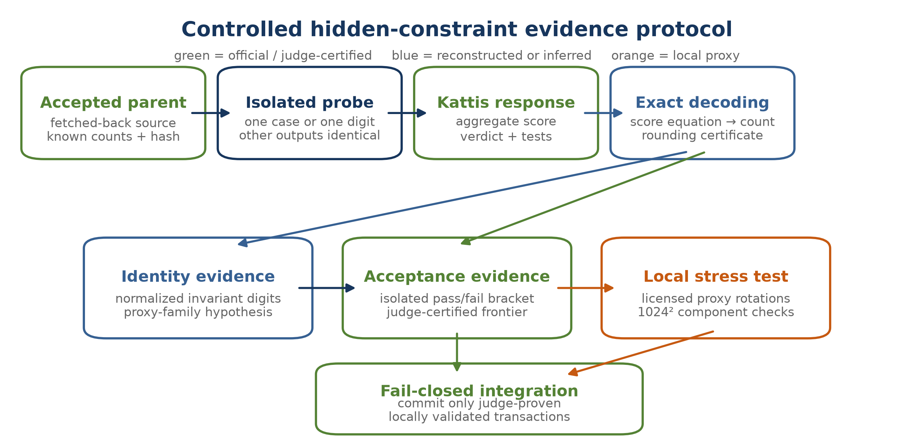
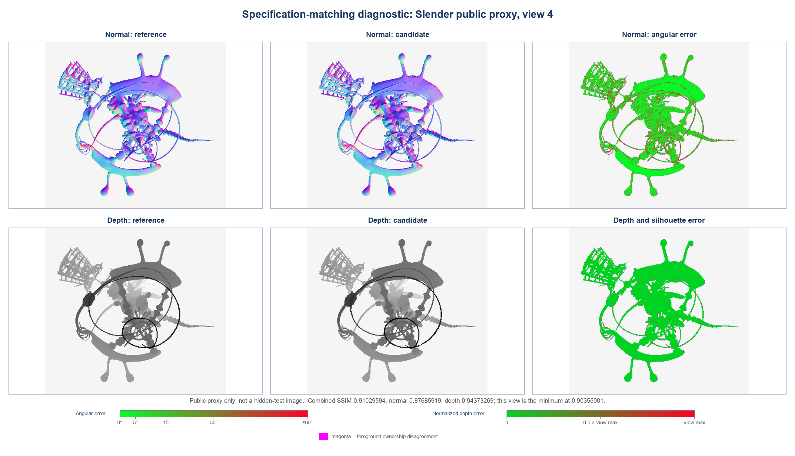
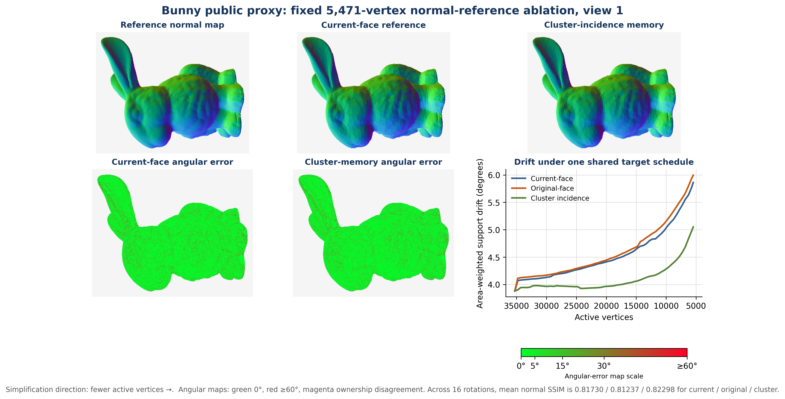
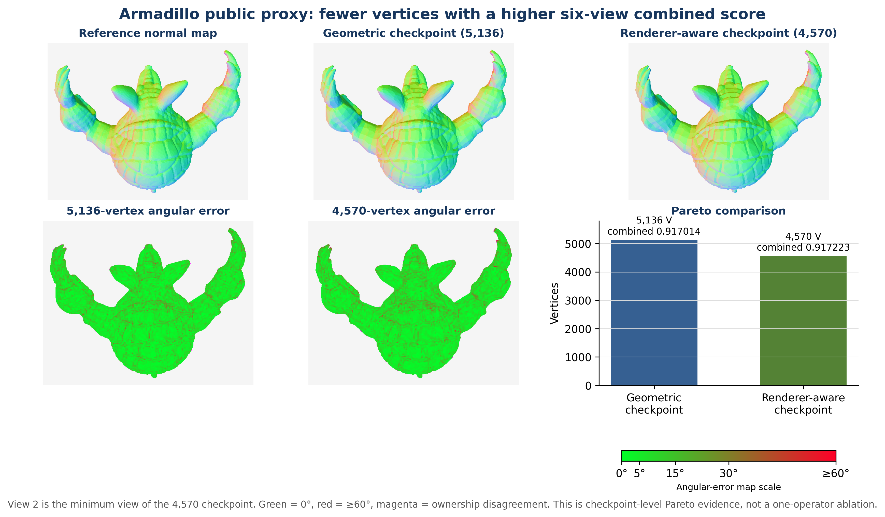
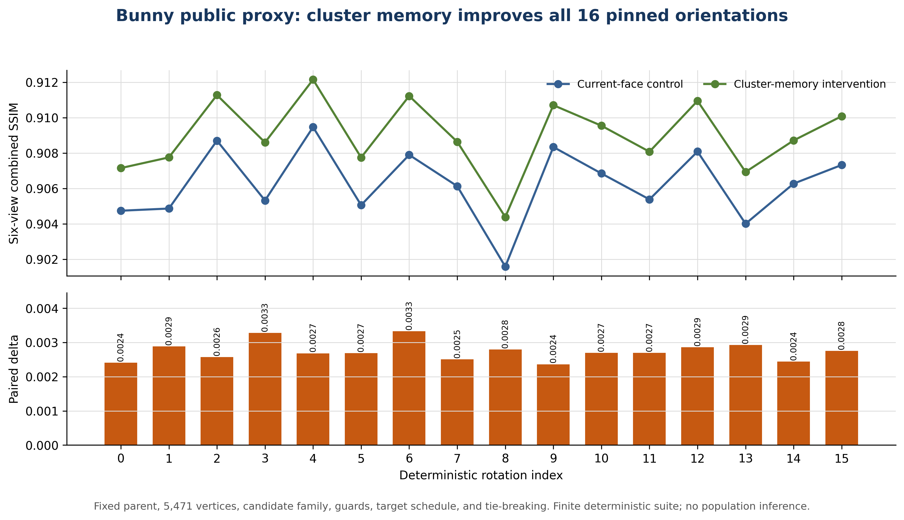

# Perception-Aware Mesh Simplification under a 21-Second and 128-KiB Budget

*Hybrid QEM, cluster-normal memory, renderer-aware topology replay, and fail-closed deployment*

Problem name: Perception-Aware Lossless Simplification of Million-Vertex 3D Meshes for Mobile Platforms

Team name: NEU.AddictedTribes

Authors: Quoc Tran Anh Le (corresponding author); Quang Minh Ha

Affiliation: National Economics University, Hanoi, Vietnam

Correspondence: lequoctran181@gmail.com

GitHub repository: [Public research artifact](https://github.com/lequoctran181/IMC_Challenge_2026)

<!-- PAGE BREAK -->

# Perception-Aware Mesh Simplification under a 21-Second and 128-KiB Budget

*Hybrid QEM, cluster-normal memory, renderer-aware topology replay, and fail-closed deployment*

<!-- TOC -->

## Abstract

The IMC Challenge problem `simplifygeometry` minimizes retained vertices subject to three conjunctive acceptance conditions: a closed non-degenerate triangular two-manifold, a symmetric vertex-set Hausdorff limit equal to five percent of the input bounding-box diagonal, and at least 0.9 similarity under the prescribed six-view flat-normal/depth renderer [1]. The program must also run within 21 seconds, use at most 2 GiB, and fit in 131,072 source bytes.

We combine guarded quadric-error contraction [2,3] with projected-area normal cost and cluster-normal memory, an additive statistic over original vertex-face incidences. A specification-matching 1024 × 1024 evaluator guides offline flips, one-ring deletions, and bounded fitting [1,10]. Successful edits are canonicalized, compressed, and replayed transactionally; any precondition mismatch returns a previously Accepted checkpoint.

Aggregate judge feedback was handled as a controlled black-box experiment. Isolated probes, algebraic count decoding, rotation-invariant fingerprints, hidden-test acceptance boundary estimation, multi-rotation proxy stress tests using up to sixteen deterministic orientations, and explicit safety margins reduced uncertainty without obtaining or redistributing hidden meshes.

<!-- BEGIN GENERATED: ARTICLE_ABSTRACT_RESULT -->
The fetched-back release, Kattis submission 20082703, was Accepted on all 7 tests with displayed score 93.830074. Its six outputs contain 34,134 vertices from 1,498,780 inputs, giving 2.277452% global retention and 97.722548% compression; the official unweighted per-case formula reconstructs 93.83007422510956.
<!-- END GENERATED: ARTICLE_ABSTRACT_RESULT -->

### Keywords

mesh simplification; quadric error metrics; structural similarity; renderer-aware optimization; edge collapse; topology preservation; Hausdorff distance; normal maps; black-box experimental design; deterministic replay; geometry compression

## 1. Introduction

### 1.1 Motivation and challenge context

High-resolution scans and authored models frequently contain far more triangles than an interactive or mobile renderer can process economically. Classical simplification replaces a dense surface with a coarser approximation, commonly using geometric distance, local curvature, or quadric error as a surrogate for quality [2-6]. The IMC Challenge changes the problem in two decisive ways. First, acceptance is renderer-defined: six fixed views are compared through flat-normal and perspective-depth images using SSIM. Second, visual similarity is necessary but not sufficient; the output must remain a closed, non-degenerate two-manifold and satisfy a hard symmetric vertex-set Hausdorff bound [1]. The target is therefore neither ordinary decimation nor unconstrained image matching.

The renderer couples combinatorics and geometry at pixel scale. A small coordinate perturbation can change depth ordering. An edge flip can alter a large constant-normal region without changing the vertex count. A geometrically inexpensive collapse can erase a silhouette feature that dominates foreground-only SSIM. Conversely, vertices invisible from all six prescribed cameras can contribute little to the perceptual score while remaining essential for closure or the distance certificate. The solver must reason simultaneously about surface geometry, topology, visibility, numerical error, runtime, and source-code entropy.

Our development began with a generic simplifier and evolved into a hybrid research pipeline. Online QEM provides a scalable proposal mechanism. Topological and radius guards establish a safe backbone. Projected normal and cluster-memory terms better align that backbone with the flat-shaded evaluator. Specification-matching local rendering then searches structural operations that QEM alone cannot express. Replay compilation moves the cost of search offline. This separation is essential: rendering every candidate collapse at 1024 × 1024 is computationally impossible for million-vertex inputs, while a local geometric metric alone plateaued far below the release score.

### 1.2 Formal task and objective

For an original triangular mesh \(M=(V,F)\), let \(M'=(V',F')\) denote the output, and let \(N_i\) and \(M_i\) denote the original and output vertex counts of scored case \(i\). The official statement fixes the structural validity predicate, a symmetric vertex-set Hausdorff tolerance, six cameras, flat-normal and depth maps, a foreground-only SSIM calculation, and a threshold of 0.9 [1]. For view \(c\), we write

$$s_c=\frac{1}{2}\operatorname{SSIM}\!\left(I^{N}_{c},I^{N'}_{c}\right)+\frac{1}{2}\operatorname{SSIM}\!\left(I^{D}_{c},I^{D'}_{c}\right).$$

The aggregate perceptual feasibility condition is

$$S_{\mathrm{vis}}=\frac{1}{6}\sum_{c=1}^{6}s_c\geq 0.9.$$

Let \(D_{\mathrm{AABB}}\) be the diagonal of the original axis-aligned bounding box, and define the directed distance \(\delta(A,B)=\max_{x\in A}\min_{y\in B}\lVert x-y\rVert_2\). The geometric constraint is

$$d_H(V,V')=\max\!\left\{\delta(V,V'),\delta(V',V)\right\}\leq\tau_H,\qquad\tau_H=0.05D_{\mathrm{AABB}}.$$

For each case, the constrained problem can be expressed as

$$\min_{M'} n(M')\quad\text{subject to}\quad\mathcal{T}(M')=1,\quad d_H\leq\tau_H,\quad S_{\mathrm{vis}}\geq0.9,$$

The deployed object is not six independently chosen meshes but one source-limited program \(\mathcal P\) applied to six fixed inputs \(X_i\). At program level the actual optimization is

$$\max_{\mathcal P}\;100\left(1-\frac{1}{6}\sum_{i=1}^{6}\frac{M_i(\mathcal P)}{N_i}\right),$$

subject, for every scored case \(i\), to

$$\mathcal T\!\left(\mathcal P(X_i)\right)=1,$$

$$d_H\!\left(X_i,\mathcal P(X_i)\right)\leq\tau_i,$$

$$S_{\mathrm{vis}}\!\left(X_i,\mathcal P(X_i)\right)\geq0.9,$$

$$T(\mathcal P,X_i)\leq21\ \mathrm{s},\qquad \operatorname{RSS}(\mathcal P,X_i)\leq2\ \mathrm{GiB},$$

$$\left|\operatorname{source}(\mathcal P)\right|\leq131072\ \mathrm{bytes}.$$

This formulation makes deployment coupling explicit: replay payload for one branch consumes bytes unavailable to another, shared parser and QEM code amortize their cost across cases, and an offline-optimal mesh is irrelevant if its decoder, running time, or working set is infeasible.

If all six scored cases are valid, Kattis ranks a submission using the unweighted mean of the six retained-vertex ratios [1]:

$$\operatorname{Score}=100\left(1-\frac{1}{6}\sum_{i=1}^{6}\rho_i\right),\qquad \rho_i=\frac{M_i}{N_i}.$$

This formula has an important allocation consequence. Removing one vertex from case \(i\) is worth \(100/(6N_i)\) points. Thus a vertex removed from the 23,201-vertex case is about 43.5 times as valuable as one removed from the 1,009,118-vertex case. A uniform target ratio is therefore rarely optimal: smaller difficult models deserve disproportionate search effort, while the largest models still require aggressive reduction to meet runtime and memory limits.

Because the objective is affine in each integer output count, one additional feasible deletion from case \(i\) is worth exactly \(\Delta_i=100/(6N_i)\). This marginal value is independent of the other counts but is zero in practice if the deletion causes any hard constraint to fail; Appendix D records the one-line derivation.

### 1.3 Assumptions, symbols, and evidence policy

The following assumptions are explicit. The official cameras, focal length, resolution, background values, flat-normal rasterization, perspective-correct depth interpolation, foreground mask, and SSIM definition are implemented from the public statement [1]. The official Hausdorff metric is between vertex sets, not continuous surfaces; we use a conservative one-directional online bound and a standalone two-directional checker. The six scored instances are fixed, and case specialization is permitted, but every specialized branch recognizes its intended input deterministically and fails closed. Kattis acceptance is final external validation, not a substitute for local testing.

**Table. Symbols and task-specific notation.**

| Symbol | Meaning |
|---|---|
| \(M=(V,F)\), \(M'=(V',F')\) | Original and simplified triangular meshes |
| \(p_v\) | Position of vertex \(v\) |
| \(n_f\), \(A_f\) | Unit normal and area of face \(f\) |
| \(Q_v\) | Symmetric homogeneous quadric at vertex \(v\) |
| \(C(v)\), \(r_v\) | Original support cluster represented by \(v\), and its radius certificate |
| \(D_{\mathrm{AABB}}\) | Original bounding-box diagonal |
| \(L_E\) | Rotation-invariant root-mean-square edge-length scale |
| \(\tau_H\) | Official Hausdorff tolerance, \(0.05D_{\mathrm{AABB}}\) |
| \(I^N_c\), \(I^D_c\) | Normal and depth image for view \(c\) |
| \(S_v\) | Additive cluster-normal summary at vertex \(v\) |
| \(S_{\mathrm{vis}}\) | Mean six-view normal/depth SSIM |
| \(D_{\mathrm{support}}\) | Area-weighted cluster-support orientation drift in degrees |
| \(\rho_i\) | Retained-vertex ratio of scored case \(i\) |
| \(N_i,M_i\) | Original and output vertex counts of scored case \(i\) |
| \(\mathcal P\), \(X_i\) | Shared deployed program and its scored input for case \(i\) |
| \(\lambda_N,\lambda_C,\lambda_{\kappa}\) | Normal, cluster-memory, and curvature weights |
| \(\gamma,\beta,\eta\) | Calibrated exponents in the corresponding surrogate terms |
| \(H,H_{\max}\) | Total lazy-heap events and maximum resident heap size |
| \(K,R,d_{\max}\) | Exact rebase count, replay-operation count, and maximum touched one-ring size |

Claims use four evidence levels. **Official** means a Kattis judgement, test count, displayed score, or fetched-back submitted source. **Reconstructed** means deterministic arithmetic, checksum, byte count, or output count derived from archived Official evidence. **Experimental** means a local measurement on a legally obtained public proxy or controlled diagnostic. **Inference** means an interpretation supported by those observations but not directly exposed by Kattis. This taxonomy is used consistently in Section 4 and in the machine-checked ledger.

The terms *certificate*, *validated*, and *exact* are restricted as follows. “Exact score reconstruction” means exact evaluation of the published rational count formula from integer counts. “Exact vertex search” means that the kd-tree returns the same minimum over the finite stored vertex set as exhaustive search, up to floating-point distance evaluation. The renderer is called *specification-matching local*, not official or bit-exact, because only the Kattis implementation can decide hidden acceptance.

**Table. Scope of certificates and explicit non-claims.**

| Claim | Mechanism and evidence | Certified scope | Explicit non-claim |
|---|---|---|---|
| Local contraction safety | Link, incidence, duplicate-face, area, and orientation guards | Modified one-ring remains a valid face-indexed two-manifold neighborhood under the stated preconditions | No continuous self-intersection or global perceptual guarantee |
| Radius certificate | Inductive cluster-radius recurrence | Original-to-output directed vertex distance for the represented original vertices | Does not imply the reverse direction or continuous-surface Hausdorff |
| Standalone Hausdorff check | Exact nearest neighbor over both finite vertex arrays | Symmetric vertex-set metric used by the public statement on the supplied files | No claim about triangle interiors |
| Structural validator | Independent parse, edge-incidence, orientation, duplicate, connectedness, and single-cycle vertex-link checks | Closed connected oriented face-indexed two-manifold surface; unused vertices reported separately | Does not infer semantic correctness of unused vertices or absence of geometric self-intersection |
| Local perceptual result | Six-view 1024 × 1024 raster/SSIM implementation and component report | Reproducible proxy measurement under this repository's code | Not an official hidden score or unseen-view quality guarantee |
| Hidden-suite acceptance | Kattis 20082703, Accepted 7/7 | The submitted source passed the organizer's hidden validation | No per-case hidden SSIM margin or placement claim is inferred |

### 1.4 Research questions and contributions

The work addresses four research questions. How can a million-vertex mesh be simplified quickly while preserving closed-manifold structure? How can a cheap local metric better predict a flat-normal renderer? How can high-fidelity local image evidence be exploited without evaluating every collapse? How can aggregate judge feedback be converted into controlled information about hidden constraints without contaminating other cases?

The main contributions are:

- A manifold-preserving QEM implementation with link-condition checks, duplicate-face rejection, orientation and degeneracy guards, a conservative cluster-radius certificate, and versioned lazy heaps suitable for inputs above one million vertices.
- A projected-area normal term and cluster-normal memory that preserves additive orientation evidence from original support faces instead of repeatedly comparing only against the current mesh.
- A renderer-aware structural stage combining specification-matching six-view evaluation, edge flips, one-ring retriangulation, coordinate fitting, and multi-rotation robustness tests.
- A black-box Inference protocol based on isolated probes, algebraic count decoding, safe diagnostic payloads, rotation-invariant fingerprints, binary acceptance-boundary search, and explicit proxy-to-hidden uncertainty margins.
- A fail-closed replay architecture that packs QEM, structural operators, case streams, validation checks, and large-case caches into 130,973 C++ bytes while staying within the 21-second limit.
- A reproducible evidence chain of accepted milestones culminating in an exact count-derived score reconstruction and a public research artifact [14].

## 2. Related Literature

### 2.1 Geometry-driven simplification

Progressive meshes established edge collapse and its inverse vertex split as a compact multiresolution representation, with an optimization objective that can account for geometry and appearance attributes [4]. Garland and Heckbert then introduced QEM, representing accumulated squared distances to planes by a symmetric four-dimensional matrix and ordering local contractions by a quadratic form [2]. Its compact ten-coefficient representation and additive update are especially well suited to a strict runtime and source budget. Garland and Heckbert later extended the formulation to color and texture attributes [3], while Hoppe developed a correspondence-based quadric for normals, colors, and other appearance data [6].

Recent high-quality work confirms that QEM remains an active framework rather than merely a historical baseline. Liu et al. replace extrinsic quadrics with accumulated intrinsic tangent information to support coarse operators and guarantee intrinsic element quality in ACM Transactions on Graphics 2023 [12]. Liu, Rahimzadeh, and Zordan add line quadrics to control distribution, feature preservation, and numerical conditioning in Computer Graphics Forum 2025 [13]. These studies reinforce two principles used here: useful global information can be agglomerated through local collapses, and additional quadratic or cluster statistics can control properties not captured by point-to-plane error alone. Our objective differs because the target is a fixed flat-normal/depth renderer rather than an intrinsic differential operator or a uniform sampling objective.

### 2.2 Topology and geometric guarantees

Local edge contraction is attractive because only a one-ring neighborhood changes, but unconstrained contraction can invert faces, introduce duplicate triangles, change genus, or create non-manifold edges. Dey et al. formalized local conditions under which edge contractions preserve topological type [9]. We use the interior link condition as a fast necessary structural guard, supplemented by explicit face and edge-incidence tests. Because the contest demands a closed two-manifold, we intentionally do not use QEM's more general non-edge aggregation mode.

Hard geometric error bounds have a separate literature. Simplification envelopes constrain the evolving surface between offsets of the original and thereby provide a global guarantee while preserving topology [7]. Metro evaluates geometric error between surfaces through sampling [8]. The challenge instead defines a symmetric distance between vertex sets [1], so our certificate follows original vertices through representative clusters and the release checker evaluates the stated finite-set metric. We cite envelope and surface-sampling work to clarify the distinction: the contest certificate is task-aligned, but it is not a universal continuous-surface guarantee.

### 2.3 Appearance- and image-driven simplification

Pure geometric proximity cannot fully predict rendered appearance. Lindstrom and Turk's image-driven simplification evaluates edge collapses through images, automatically balancing silhouette, shading, texture, and hidden-region effects [5]. More recently, Hasselgren et al. formulated appearance-driven model simplification as analysis by synthesis, jointly optimizing geometry and shading through rendered image differences [11]. These works are the closest conceptual relatives of our renderer-aware stage.

The contest setting introduces unusual constraints absent from a general offline renderer. The images are fixed flat normals and depths; the acceptance threshold is hard; only six views matter; hidden instances must be solved by a 21-second C++ program; and the source limit leaves only 99 bytes of release headroom. We therefore do not make the full renderer differentiable or place it inside every collapse. Instead, a cheap surrogate guides bulk decimation, specification-matching local rendering is reserved for checkpoints and small structural neighborhoods, and accepted operations are compiled into replay streams.

### 2.4 Structural similarity and task-specific perception

SSIM compares local luminance, contrast, and structural terms rather than treating pixels as independent squared errors [10]. The official problem applies a specified SSIM variant to foreground normal and depth images [1]. This matters algorithmically. A few changed silhouette pixels, a normal discontinuity spanning a large triangle, or a z-buffer ownership change can affect local windows in ways that are not proportional to Euclidean vertex displacement. The optimization landscape is therefore non-smooth even when the underlying coordinates vary continuously.

Our local projected-area term should not be interpreted as a new universal perceptual metric. It is a computational surrogate for projected importance under the six prescribed cameras; it does not model occlusion, clipping, z-buffer ownership, or silhouette visibility. The specification-matching local evaluator is the checkpoint-scale decision rule, while Kattis is the external arbiter for hidden tests.

### 2.5 Positioning of the present work

The method combines ideas from geometry-driven, topology-preserving, and image-driven simplification but adds a contest-specific systems layer. QEM supplies throughput [2]. The link condition and explicit combinatorial checks protect topology [9]. Cluster radius carries a cheap task-specific distance certificate. Cluster-normal memory parallels the additive spirit of appearance quadrics [3,6] but aggregates original face-normal evidence rather than per-vertex attributes. Specification-matching rendering follows the image-driven principle [5,11]. Checkpoints, fingerprint probes, packed replays, and fail-closed integration make the resulting search executable within strict external limits.

Unlike appearance quadrics that aggregate vertex attributes into a quadratic error model, cluster-normal memory stores original face-incidence area vectors as a persistent nonlinear orientation reference for the evolving flat-shaded face field. Its purpose is not attribute interpolation, but preventing the collapse objective from continually redefining its reference on an already degraded mesh.

**Table. Positioning relative to representative mesh-simplification literature.**

| Prior work | Objective | Accumulated state | Renderer role | Difference here |
|---|---|---|---|---|
| QEM [2,3] | Point-to-plane and appearance-attribute error | Additive quadrics | No | Adds hard guards, incidence normal memory, and fixed-renderer calibration |
| Progressive meshes [4] | Compact multiresolution representation | Collapse/split hierarchy | Optional attributes | Uses one-way compact replay under a source and runtime budget |
| Image-driven simplification [5] | Rendered image fidelity | Multiple views | Directly evaluates proposals | Reserves rendering for checkpoints and small structural neighborhoods |
| Appearance-driven analysis-by-synthesis [11] | Joint geometry/appearance fit | Differentiable rendered evidence | Central optimization signal | Targets fixed flat normal/depth maps with discrete topology operators |
| Intrinsic and line quadrics [12,13] | Element quality, feature control, sampling | Additive intrinsic/line statistics | No | Uses an incidence-weighted original-normal statistic tied to the contest renderer |

## 3. Methodology

### 3.1 Research design: a multi-fidelity evidence loop

The methodology is a sequence of increasingly expensive filters. A candidate begins as a change to a cheap local cost or target count. It is generated deterministically, checked for structural validity, tested against a conservative distance bound, evaluated with the specification-matching 1024 × 1024 renderer, challenged across rotations, integrated into a byte-identical Accepted parent, and only then submitted as an isolated probe. An Accepted source is fetched back from Kattis, hashed, and archived before further work. This loop converts an opaque optimization problem into a chain of falsifiable hypotheses.


The system deliberately separates three models. The **proposal model** is QEM plus cheap normal and cluster terms. The **measurement model** is the specification-matching local renderer and independent validators. The **deployment model** is a compressed C++ replay with conservative fallbacks. Confusing these roles caused early failures: a locally good proposal was not necessarily valid, and an offline-optimal mesh was not necessarily representable under the runtime or source budget.

### 3.2 Guarded QEM backbone

For each original face \(f\), let its normalized plane be \(\pi_f=(a,b,c,d)^{\mathsf T}\) and let \(w_f\) be an optional area or curvature weight. The fundamental face quadric is [2]

$$K_f=w_f\pi_f\pi_f^{\mathsf T}.$$

The quadric at a vertex is the sum of incident face quadrics:

$$Q_v=\Sigma_{f\ni v}K_f.$$

Contracting an edge \((u,v)\) to candidate position \(p\) combines the quadrics additively. With homogeneous coordinate \(p_h=(p_x,p_y,p_z,1)^{\mathsf T}\), the geometric cost is

$$E_Q(u,v,p)=p_h^{\mathsf T}(Q_u+Q_v)p_h.$$

The implementation evaluates multiple targets: both endpoints, midpoint, cluster-size-weighted interpolation, the unconstrained three-by-three minimizer when well conditioned, and a stationary point restricted to the segment. Evaluating several targets is inexpensive relative to neighborhood validation and prevents singular or poorly conditioned quadrics from forcing an unsafe position.

The cheapest target is accepted only when every guard passes:

- **Link condition:** an interior manifold edge has exactly the two common neighbors implied by its incident triangles [9].
- **Face validity:** every surviving affected triangle has three distinct indices and area above a scale-aware threshold.
- **Orientation:** a surviving face cannot flip or exceed the configured normal deviation.
- **Combinatorics:** local link, duplicate-triangle, self-loop, and affected edge-incidence conditions pass before contraction.
- **Distance:** the propagated cluster radius stays below a conservative tolerance.

**Proposition 2 (local manifold preservation under a guarded contraction).** Let \(M\) be a closed orientable triangular two-manifold and let \((u,v)\) be an interior edge. If the link condition holds, all surviving affected faces remain non-degenerate and consistently oriented, and the contraction creates neither a duplicate face nor an edge of incidence other than two, then replacing \((u,v)\) by the contracted vertex preserves the closed two-manifold property in the modified neighborhood [9].

**Proof sketch.** The link condition states that the intersection of the links of \(u\) and \(v\) is exactly the link of edge \((u,v)\). Consequently, identifying the two endpoints removes precisely the two incident triangles and glues the two remaining one-ring arcs without pinching an unrelated sheet. Distinct positive-area surviving faces prevent local dimension loss; consistent orientation preserves the cyclic order of the link; duplicate and incidence guards prevent multi-edges or more than two faces from sharing an edge. Outside the one-ring the complex is unchanged. The contraction path enforces these local link and face conditions. Connectedness, global edge incidence, and every used vertex link are rechecked independently at checkpoint/export validation.

### 3.3 Cluster-radius distance certificate

Each live vertex \(v\) represents a cluster \(C(v)\) of original vertices and stores a radius \(r_v\) satisfying

$$\forall x\in C(v):\quad \lVert x-p_v\rVert_2\leq r_v.$$

If \(u\) and \(v\) contract to \(p\), the propagated radius is

$$r_{u\cup v}(p)=\max\!\left(r_u+\lVert p_u-p\rVert_2,\;r_v+\lVert p_v-p\rVert_2\right).$$

**Lemma 1 (cluster-radius invariant).** After any sequence of guarded contractions, every live vertex \(v\) satisfies

$$\max_{x\in C(v)}\lVert x-p_v\rVert_2\leq r_v.$$

**Proof sketch.** Initially \(C(v)=\{p_v\}\) and \(r_v=0\), so the claim holds. Assume it holds for clusters \(C(u)\) and \(C(v)\). For any \(x\in C(u)\), the triangle inequality gives

$$\lVert x-p\rVert_2\leq\lVert x-p_u\rVert_2+\lVert p_u-p\rVert_2\leq r_u+\lVert p_u-p\rVert_2.$$

The analogous inequality holds for \(x\in C(v)\). Taking the maximum over the disjoint union \(C(u)\cup C(v)\) yields exactly the recurrence above. Induction completes the proof.

**Corollary 1 (directed vertex-set certificate).** If the live clusters partition the original vertex set and every live radius is at most \(\tau\), then

$$\delta(V,V')\leq\tau.$$

**Proof sketch.** Each original vertex belongs to one live cluster and is within its representative radius. Its nearest output vertex is no farther than that representative. Taking the maximum over original vertices proves the bound. The reverse direction \(\delta(V',V)\) is not implied and is therefore checked independently.

Rejecting a contraction when its propagated radius exceeds a safe threshold thus certifies the original-to-simplified direction for assigned representatives. The exported mesh is independently validated using a spatial nearest-neighbor structure. A safety margin below the official tolerance absorbs floating-point evaluation, rebasing, and output quantization.

This certificate is intentionally conservative. It can reject feasible contractions because it bounds every represented original vertex by a common ball. That conservatism is valuable during bulk simplification: the exact distance checker is reserved for checkpoints, while no accepted online contraction can silently accumulate unbounded displacement.

### 3.4 Perception-aware collapse objective

Pure QEM preserves supporting planes but does not directly model the flat-normal images. We use the composite proposal cost

$$E=E_Q+\lambda_NE_N+\lambda_CE_C+\lambda_RE_R.$$

The optional regularizer \(E_R\) represents case-specific curvature or projected-importance allocation. Heap insertion deliberately uses a cheaper approximation: it selects the radius-feasible position with minimum QEM and evaluates the composite objective only there. When the edge reaches the heap top, the current one-ring is rebuilt, every candidate position is scored once by the full composite, and valid positions are ordered by `(composite cost, candidate type, coordinates)`. The readable core stores heap costs in double precision and uses a lexicographic edge tie-break. The byte-exact Accepted source used a more compressed float-key implementation; our reproducibility claim for that production artifact is its fetched-back hash and observed Kattis result, not universal cross-platform bit identity.

#### 3.4.1 Projected-area normal distortion

For every surviving affected face \(f\), let \(n_f\) and \(n'_f(p)\) be its current and candidate normals. Object-space area alone is a poor estimate of raster impact, because a large edge-on face may cover few pixels. We approximate total six-view coverage by a projected area \(A_f^{\mathrm{proj}}\) and define

$$E_N(u,v,p)=\Sigma_{f\in\mathcal A(u,v)}A_f^{\mathrm{proj}}\left[1-\operatorname{clamp}\!\left(n_f\cdot n'_f(p),-1,1\right)\right]^{\gamma}.$$

Define the idealized six-camera projected area by

$$A_f^{\mathrm{proj}}=\sum_{c=1}^{6}A_{f,c}^{\mathrm{proj}}.$$

Under an orthographic, no-occlusion approximation, opposite axial cameras contribute the same magnitude, so

$$A_f^{\mathrm{proj}}=2A_f\left(\operatorname{abs}(n_x)+\operatorname{abs}(n_y)+\operatorname{abs}(n_z)\right)=2A_f\lVert n_f\rVert_1.$$

The implementation evaluates three unoriented coordinate-plane magnitudes with the face-oriented camera sign and perspective depth. The constant factor two from opposite camera pairs is absorbed into \(\lambda_N\). Alternative modes use object-space area or absolute projected components. This is not a visibility term: it ignores occlusion, clipping, ownership, and foreground boundaries. Projected mode was most reliable on the Bunny-like case, though the specification-matching renderer still decided final operations.

Ignoring occlusion, clipping, and perspective, the exact axial bounds are

$$2A_f\leq A_f^{\mathrm{proj}}\leq2(3^{1/2})A_f.$$

The implementation absorbs the common factor two into its calibrated weight, so the ratio between the upper and lower bounds remains the square root of three. This elementary bound, derived in Appendix D, motivates a cheap importance surrogate but not an exact pixel count.

#### 3.4.2 Cluster-normal memory

Repeatedly comparing a candidate with current faces creates reference drift. Every individual step can look acceptable while the aggregate surface slowly rotates away from the original. The implementation therefore defines the statistic from the original vertex-face incidence relation, not from an informal set of nearby faces. Let \(F_0\) be the original faces and let

$$a_f=(p_{f,2}-p_{f,1})\times(p_{f,3}-p_{f,1})=2A_fn_f.$$

For every original vertex \(x\), initialization adds \(a_f\) once for each incidence \(x\in f\). If a live vertex \(v\) represents the multiset \(C(v)\) of original vertices absorbed into it, its stored vector is

$$S_v=\Sigma_{x\in C(v)}\Sigma_{f\in F_0}\mathbf 1[x\in f]a_f.$$

This incidence-weighted definition intentionally counts an original face once for each of its incident original vertices in the cluster. At a contraction, the stored values merge by \(S_{u\cup v}=S_u+S_v\). When \(\lVert S_v\rVert_2>\epsilon_C\), define the normalized support direction

$$u_v=\frac{S_v}{\lVert S_v\rVert_2}.$$

The direction \(u_v\) is undefined otherwise. For a surviving affected current face \(g=(v_1,v_2,v_3)\), the old and proposed targets used by the code are

$$T_g=\sum_{j=1}^{3}u_{v_j},$$

$$T'_g=\sum_{j=1}^{3}u'_{v_j},$$

where either contracted endpoint is replaced by the normalized merged vector in the proposed state. For portability, define the cosine and penalty separately:

$$c(b,T)=\operatorname{clamp}\!\left(\frac{b^{\mathsf T}T}{\lVert b\rVert_2\lVert T\rVert_2},-1,1\right),$$

$$\phi(b,T)=\left(1-c(b,T)\right)^{\beta}.$$

With \(b_g\) and \(b'_g\) denoting the current and proposed area vectors, mode 2 implements

$$E_C(u,v,p)=\Sigma_{g\in\mathcal A_{\mathrm{surv}}(u,v)}\lVert b_g\rVert_2\left[\phi(b'_g,T'_g)-\phi(b_g,T_g)\right].$$

The subtraction is important: an operation that repairs accumulated drift can receive negative credit. If a stored vector or a three-vertex target cancels to norm at most \(\epsilon_C\), its normalized direction is undefined; the readable implementation rejects that candidate's cluster term rather than manufacturing a direction. On the 35,292-vertex case, the decisive early setting used \(\lambda_N=0.003\), \(\gamma=0.75\), projected area, \(\lambda_C=0.0001\), and \(\beta=0.5\).

The controlled ablation also reports a mechanism-aligned support-drift diagnostic. Reindex the \(m\) active faces with defined targets by \(g=1,\ldots,m\), and let

$$\theta_g=\arccos\!\left(c(b_g,T_g)\right).$$

Define its angular moment and total area-vector weight separately,

$$A_{\theta}=\sum_{g=1}^{m}\lVert b_g\rVert_2\theta_g,\qquad W=\sum_{g=1}^{m}\lVert b_g\rVert_2.$$

Then the area-weighted mean drift in degrees is

$$D_{\mathrm{support}}=\frac{A_{\theta}}{W}\frac{180}{\pi}.$$

Here \(\lVert b_g\rVert_2=2A_g\), and \(T_g\) is the same sum of normalized original-incidence support directions used by the cluster term. Faces whose target norm is at most the implementation threshold are omitted from both sums and counted separately; zero-area faces are rejected by validation and are skipped defensively by the trace code. The Bunny trajectories were sampled initially, after every 500 committed collapses, and at the final target. Their horizontal coordinate is the number of active vertices, so it decreases as simplification proceeds; all three final traces reported zero undefined targets. Support drift is a mechanism-aligned diagnostic derived from the same original-incidence statistic; combined SSIM is the independent rendered outcome.

**Proposition 3 (merge-tree invariance for a fixed cluster partition).** Fix the original incidences and a live cluster multiset \(C\). Any binary merge tree whose leaves are exactly the same elements of \(C\) produces the same stored vector

$$S_C=\Sigma_{x\in C}\Sigma_{f\in F_0}\mathbf 1[x\in f]a_f.$$

**Proof sketch.** Every original vertex-incidence contribution is fixed at initialization. Internal nodes add the two disjoint child multisets, so associativity and commutativity of vector addition yield the same finite incidence sum. Normalization is performed only after the sum is requested and is not stored recursively.

This is deliberately a narrow order-invariance claim. Two collapse sequences that finish with different cluster memberships, surviving vertex identities, topology, or geometry need not have equal targets or penalties. Even for the same partition, floating-point addition can differ by roundoff unless the summation order is canonical. The property being protected is the mathematical original-support statistic, not the entire simplification trajectory.


### 3.5 Specification-matching local evaluator and component diagnostics

The local CPU evaluator implements the public specification [1]: six positive and negative Cartesian cameras, camera distance 2.5, resolution 1024 × 1024, focal length 800, center at pixel coordinate 512, pixel-center sampling, nearest-triangle z-buffering, flat per-face normal encoding, perspective-correct reciprocal depth, 11 × 11 SSIM windows, foreground masking, and equal normal/depth weight. The default `official` profile fixes these values and deliberately ignores ambient `FOCAL`, `GAUSSIAN`, and `NORMALIZE_ARM_RAW` variables; nonofficial kernels, focal lengths, or transforms require an explicit `--profile experimental` command-line selection. Lower resolutions emit a screening-only warning because 512 × 512 evaluations reversed several near-threshold rankings. All evaluator entry points parse meshes fail-closed and reject invalid indices, repeated face indices, zero-area faces, duplicate unoriented faces, non-finite coordinates, and trailing data instead of silently skipping them.

Three evaluators support diagnosis. The fast evaluator reports combined VPS. The component evaluator reports normal and depth SSIM for each view, identifying which signal is active. The oracle-normal variant replaces or isolates normal information to distinguish a bad topology from a bad normal surrogate. Synthetic tests compare kd-tree distances with brute force, exercise exact and one-unit-in-the-last-place tolerance boundaries, cover all six camera signs, reciprocal-depth interpolation, strict-less z-buffer ties, foreground union, SSIM border and zero-variance cases, and require fast/component equality on non-identical meshes. Agreement with the public statement is strong local evidence, but no local result is relabelled as an Official hidden-test measurement.

### 3.6 Renderer-aware structural operators

#### 3.6.1 Edge flips

Two adjacent triangles \((a,b,c)\) and \((b,a,d)\) can exchange diagonal \(ab\) for \(cd\). The vertex count and vertex-set Hausdorff distance remain unchanged, but the piecewise-planar normal field can change substantially. We require positive orientation, no duplicate faces, preserved edge incidence, and unchanged closure before measuring the specification-matching render delta. Flips are especially valuable before deletion because they can redistribute normal error and make a one-ring easier to triangulate.

An edge flip leaves the output vertex set identical, so it leaves vertex count and both directed vertex-set distances unchanged. It can nevertheless change flat normals and z-buffer ownership; topology and raster effects therefore still require independent checks.

#### 3.6.2 One-ring fan deletion and retriangulation

Deleting a vertex removes its incident fan and leaves a polygonal ring. For low valence, all combinatorially valid triangulations can be enumerated through Catalan recursion. For larger rings, restricted fans and dynamic-programming families reduce the search space. Each proposal is screened for orientation, duplicates, manifoldness, and distance before rendering. A deletion is accepted only when the locally measured worst relevant view remains above its branch-specific diagnostic margin while the six-view mean satisfies the release margin.

#### 3.6.3 Coordinate and tangent fitting

After topology stabilizes, selected vertices are perturbed in coordinate, tangent, or normal directions. The objective is the local combined SSIM subject to triangle-area, orientation, and distance guards. Finite-difference or coordinate-search steps operate only inside bounded trust regions. Foreground cropping reduces cost on the million-vertex branch. Coordinate fitting is a margin-restoration tool, not a substitute for topology search: large gains generally required a flip or deletion first.

The distance certificate has an explicit lifecycle because not every offline operator preserves the cluster partition.

**Table. Lifecycle of the vertex-set distance certificate across online and offline operators.**

| Operation | Online certificate action | Exact checkpoint action | Commit rule |
|---|---|---|---|
| Edge collapse | Propagate the cluster radius by the triangle-inequality recurrence | Recompute both finite vertex-set directions at scheduled checkpoints | Reject if the propagated radius or exact symmetric check exceeds its margin |
| Edge flip | Preserve the coordinate set exactly; both directed vertex-set distances are unchanged | Re-run structural checks and renderer only | Commit only after orientation, incidence, duplicate-face, and vertex-link checks |
| Fan deletion | Invalidate the deleted representative's local radius assignment | Recompute both distance directions on the full candidate | Commit only if topology, distance, and perceptual margin all pass |
| Coordinate fitting | Increase each affected support bound by the fitted displacement; reject outside the trust region | Recompute the exact symmetric vertex-set distance | Commit only after area, orientation, and exact distance checks |
| Rebase | Reconstruct incidences, quadrics, support summaries, and active representatives | Compare the rebased coordinates with the preceding validated checkpoint | Continue only from a fully validated, count-checked state |

### 3.7 Discovering hidden constraints without hidden inputs

Kattis exposed only an overall verdict and score, not per-case render components or hidden meshes. We treated this as a black-box experimental-design problem. No hidden file was downloaded, reconstructed, or placed in the public artifact. The submitted program could, however, compute statistics of its own input at runtime, and the displayed score could reveal a carefully controlled output count.



#### 3.7.1 Isolation and count decoding

A useful probe changes exactly one case \(k\), while the other five output counts equal those of a known Accepted parent; byte identity is claimed only when canonical outputs were retained. If the displayed score is \(S\) and all other output counts are known, the changed count is recovered as

$$M_k=\operatorname{round}\!\left(N_k\left[6\left(1-\frac{S}{100}\right)-\Sigma_{i\neq k}\frac{M_i}{N_i}\right]\right).$$

For the 23,201-vertex case, one output vertex changes the score by approximately 0.00071836, so six displayed decimals uniquely determine the integer. This converts an aggregate score into a case-specific measurement while preserving scientific control: only one unknown changes.

If the displayed score error is at most \(\varepsilon\), nearest-integer count decoding is unique whenever \(2\varepsilon<100/(6N_k)\). With six displayed decimals, \(\varepsilon\leq0.5\times10^{-6}\); even the million-vertex branch has adjacent-count spacing about \(1.65\times10^{-5}\), so the condition holds for all six cases. Appendix D gives the interval argument.

#### 3.7.2 Exact-coordinate diagnostic carriers and scope rules

Let \(B_k\) be a conservative Accepted base count for case \(k\), and let \(h\) be a small nonnegative diagnostic integer. A diagnostic branch outputs its normal manifold mesh plus unused vertices whose coordinates exactly duplicate coordinates already present in the face-referenced base mesh, giving

$$M_k=B_k+h.$$

Faces continue to reference only the Accepted base geometry. The added count reduces the diagnostic score but does not endanger Kattis's stored best. After Kattis reports the score, the equation above recovers \(h\). Multi-part fingerprints are emitted as base-\(B\) digits,

$$H=d_0+Bd_1+\cdots+B^{m-1}d_{m-1},$$

using separate isolated probes when the safe count slack cannot carry the entire integer.

For any declared vertex list \(P\), define its coordinate-set operator by

$$X(P)=\{p_i:\ p_i\text{ is declared in }P\}.$$

**Lemma 5 (invariance of an unreferenced exact-coordinate duplicate carrier).** Let the base output have declared vertex list \(P\), face list \(F\), and face-referenced coordinate set \(X(P)\). Form \(P_{\mathrm{aug}}\) by appending finite vertices, each with coordinates exactly equal to an element of \(X(P)\), while leaving \(F\) byte-identical. Then

$$X(P_{\mathrm{aug}})=X(P).$$

Under face-indexed surface semantics, the triangular surface, topology, normal/depth rasterization, and both directed vertex-set Hausdorff distances to the reference are unchanged. Only the declared count, vertex multiplicities, and predicates that inspect unused indices can change. The proof is moved to Appendix D; exact duplication is essential, because an arbitrary unused point can increase the output-to-reference directed distance.

We used the carrier only under five fail-closed rules: coordinates had to be finite and exactly duplicated from a used base vertex; all faces had to remain byte-identical; the payload had to fit a precomputed nonnegative count slack; one isolated probe first established that the judge parser permitted unused duplicates; and the diagnostic was never described as a quality improvement. The official observation is surfaced as event `unused-duplicate-parser-probe` in the evidence ledger. Its submission identifier and emitted output were not retained, so the record states that limitation explicitly. This is observed judge semantics, not a claim that the organizer endorsed the carrier technique. The standalone validator reports unused and duplicate-coordinate vertices separately and offers a stricter `--require-all-used` mode so that the semantic assumption is visible rather than hidden.

The evidence boundary was equally strict. Statistics were computed solely by the submitted program from the mesh it was legitimately given; probes changed no external file, used no network or side channel, and attempted to recover only small decision-relevant invariants and counts. We neither reconstructed nor redistributed a hidden mesh. The method is an experimental-design technique for aggregate feedback, not a claim of access to organizer data.

The standard radix restriction \(0\leq d_j<B\) makes the displayed base-\(B\) expansion unique; Appendix D records the modular argument. Separate probes were still necessary to keep every carrier within independently validated count slack.

#### 3.7.3 Rotation-invariant fingerprints

Proxy identity cannot be inferred reliably from vertex count alone. We used invariants computed from normalized geometry: quantized bounding-box ratios, genus and component count, sorted normalized edge-length multisets, edge-graph labels, orientation signatures, and order-sensitive hashes when raw ordering mattered. For the rotation-invariant length channel, define

$$L_E=\left(\frac{1}{N_E}\Sigma_{(a,b)\in E}\lVert p_a-p_b\rVert_2^2\right)^{1/2},$$

and quantize

$$q_e=\operatorname{round}\!\left(B_q\frac{\lVert p_u-p_v\rVert_2}{L_E}\right),$$

then hashes the sorted multiset of \(q_e\). Normalization removes translation and uniform scale; lengths remove rotation; sorting removes edge enumeration order. For the 23,201-vertex branch, three recovered base-15,776 digits were 2,382, 13,367, and 11,736, matching a public proxy across invariant channels and differing from aggregated proxy variants. Independent pose, edge-graph, orientation, scale, and ordering codes agreed. This supplied evidence for selecting the relevant public proxy without exposing hidden coordinates.

Under a similarity transform \(p\mapsto sRp+t\), translation cancels in edge differences, orthogonal \(R\) preserves length, and division by \(L_E\) cancels \(s\). Sorting removes enumeration order. Quantization adds only deterministic bin-boundary sensitivity; Appendix D gives the full algebra. Axis-aligned bounding-box ratios remain a separate pose-sensitive channel.

For the 35,292-vertex case, a conservative diagnostic output encoded normalized bounding-box statistics. The recovered values matched the public Bunny proxy, while acceptance behavior still showed a proxy-to-hidden renderer gap. We therefore separated **identity evidence** from **acceptance evidence**: a matching invariant justifies which geometry family to study, but only isolated Kattis probes establish an observed hidden-test boundary.

#### 3.7.4 Acceptance-boundary search and uncertainty control

Once a branch was identified, target counts were reduced by binary or bracketed search. Each probe changed one target or one operator family. A pass lowered the observed Accepted boundary; a failure tightened the rejected side. Near runtime limits, repeated identical submissions distinguished stochastic load from systematic timeout, but repeated failures triggered engineering rather than indefinite resubmission.

Public proxies were rotated through sixteen orientations when practical. A candidate had to pass structural, distance, and specification-matching render checks across selected rotations, with an explicit margin. Rotation 04 was especially predictive for Lucy and Nefertiti during early tuning, but no single rotation was treated as a decisive proxy. Hidden acceptance boundaries were recorded separately from local proxy thresholds to avoid retroactively labeling proxy scores as Kattis measurements.

### 3.8 Case-specialized solving

The score formula and different perceptual bottlenecks make one universal retained ratio suboptimal. Exact input size and conservative signatures choose a common core with specialized schedules.

**Table. Separation between generic mechanisms and case-specialized policy.**

| Stage | Generic mechanism | Case-specific element | Runtime or offline |
|---|---|---|---|
| Parse and structural state | Buffered modified-OBJ parser; flat incidence arrays | Normalization only where required by a known branch | Runtime |
| Input recognition | Size plus fail-closed invariant checks | Expected signatures and branch dispatch | Runtime |
| Bulk simplification | Guarded QEM, candidate positions, radius and topology checks | Targets, weights, rebase schedule, heap caps | Runtime |
| Perceptual diagnostics | Shared rasterizer, component SSIM, topology and Hausdorff tools | Proxy rotations and safety margins | Offline |
| Structural search | Shared flip, fan-deletion, and coordinate-fit operators | Neighborhoods, accepted edit sequence, quantization scale | Offline |
| Deployment | Shared decoder, transaction checks, compact output | Bit-packed replay streams and reference caches | Runtime |

**Table. Per-case final counts, bottlenecks, and deployment strategies.**

| Case | Input vertices | Final vertices | Retained | Dominant bottleneck and final strategy |
|---|---:|---:|---:|---|
| Sphere-like | 4,098 | 25 | 0.6101% | Analytic smooth structure; guarded tiny branch |
| Armadillo | 23,201 | 4,340 | 18.7061% | Flat-normal detail; canonical replay, flips, fitted coordinates |
| Bunny-like | 35,292 | 2,839 | 8.0443% | Normal drift and silhouette; cluster memory, fan deletion, fitting |
| Lucy | 49,987 | 3,030 | 6.0616% | Tight normal/SSIM boundary; repeated flip-delete-fit cycles |
| Slender | 377,084 | 7,400 | 1.9624% | Curvature allocation and runtime; fitted replay, 40 flips, cache |
| Nefertiti | 1,009,118 | 16,500 | 1.6351% | Runtime, memory, facial detail; staged QEM and cropped fitting |

The Sphere-like case admits a tiny guarded structural construction. Armadillo consumes the largest score loss and therefore received the most renderer-aware structural work. Bunny motivated cluster-normal memory. Lucy required careful operation ordering because local Hausdorff headroom did not imply normal-map headroom. Slender was geometrically compressible but exposed a runtime failure until reference caching. Nefertiti required staged passes, bounded heaps, and cropped fitting to stay within compute and memory limits.

### 3.9 Checkpoints, canonical replay, and transaction safety

Offline search can take hours; the submitted program cannot. We compile discoveries into deterministic operation streams. Vertex references are expressed in canonical current-mesh order or through stable local signatures rather than fragile temporary indices. Topology operators, fan choices, and quantized coordinate residuals are bit-packed. Repeated instruction fragments share dictionaries or base-94 payloads.

Replay is transactional. Before a specialized block, the current mesh is either checkpointed or reconstructible from a previously Accepted prefix. Every deletion, flip, and coordinate edit checks its expected local topology. A block commits only if its final count and structural invariants match; otherwise it rolls back or retains that checkpoint. This behavior makes the final source a compact guarded construction rather than an unchecked precomputed mesh dump.

Let \(\mathcal I(M)\) denote the structural, count, checksum, and checkpoint predicates required of a replay state. A transaction exposes a new state only after verifying \(\mathcal I\); otherwise it restores the preceding validated checkpoint. Therefore a timeout guard or unexpected signature returns the most recent validated prefix rather than a partially applied operation block. The elementary induction establishing this fail-closed property is stated in Appendix D. Its scope is deliberately narrow: perceptual acceptance and the complete two-directional distance check remain separate release gates.

### 3.10 Runtime, memory, and source-budget engineering

Pointer-heavy half-edge structures were avoided on the largest input. Positions, faces, active flags, quadrics, cluster statistics, versions, and initial incidence live in flat arrays. New incidences are appended to compact linked storage. A binary heap stores candidate edges; endpoint versions invalidate stale entries lazily. Periodic pruning bounds heap growth. Input uses a buffered character parser and output uses a one-mebibyte writer.

Rebase checkpoints rebuild current adjacency and quadrics from the complete live arrays, controlling stale topology and allowing later stages to use smaller identifiers. Foreground crop boxes limit renderer work. Reference caches prevent repeated projection and normalization on Slender and Nefertiti. Static storage reduced allocator overhead and, on Kattis, improved runtime stability compared with otherwise equivalent dynamic variants.

Let \(V\), \(F\), and \(E\) denote the input vertex, face, and edge counts; \(H\) the total number of lazy-heap events; \(H_{\max}\) the maximum resident heap size; \(K\) the number of exact rebases; \(R\) the number of replayed local operations; and \(d_{\max}\) the maximum touched one-ring size. The implementation has the following parameterized bounds.

**Table. Parameterized online time and memory bounds.**

| Stage | Time bound | Additional memory | Role |
|---|---:|---:|---|
| Parse, incidence, initial quadrics | \(O(V+F+E)\) | \(O(V+F+E)\) | Establish the first validated state |
| Lazy QEM search | \(O(H\log H_{\max})\) | \(O(H_{\max})\) | Rank and invalidate collapse proposals |
| \(K\) full rebases | \(O(K(V+F+E))\) | Reuses base arrays | Control drift and stale topology |
| Guarded local replay | \(O(Rd_{\max})\) | \(O(d_{\max})\) scratch | Apply fitted flips, deletions, and moves |

Summing the phase bounds gives online time \(O((K+1)(V+F+E)+H\log H_{\max}+Rd_{\max})\) and memory \(O(V+F+E+H_{\max})\), excluding output buffering. The bound is deliberately parameterized because lazy invalidation can make \(H\) larger than \(E\), while periodic pruning controls \(H_{\max}\).

The 131,072-byte source limit became a second optimization problem. Replay payloads were entropy-coded, recurring code fragments were factored, safe whitespace was removed, and unused diagnostic branches were stripped. Every minified candidate was compiled independently and run on the official sample. The final fetched-back source is 130,973 bytes, leaving 99 bytes of headroom.

**Table. Official and reconstructed production quantities.**

| Observable production quantity | Value | Evidence and interpretation |
|---|---:|---|
| Fetched-back source | 130,973 / 131,072 bytes | Official artifact size; 99-byte headroom |
| Packed replay and coordinate bodies | 74,211 bytes | Exact contents of 44 raw-string payload blocks |
| Raw-string framing | 308 bytes | Exact opening and closing delimiter bytes |
| Executable code and declarations | 56,454 bytes | Parser/output, QEM, recognition, decoders, caches, macros, identifiers, and ordinary literals |
| Kattis tests | 7 / 7 | Official submission result |
| Kattis runtime field | Not exposed | The available submission endpoint returned an empty field for 20082703 |
| Kattis peak memory field | Not exposed | The archived manager output contained no value; none is inferred |

The three source components form a disjoint byte-exact partition and sum to 130,973. The partition is machine-checked by `check_source_byte_breakdown.py` against the fetched source and its SHA-256 digest. A finer per-case attribution would be subjective because minified decoders and macro bodies are shared; the artifact therefore reports the exact payload-versus-code boundary rather than presenting unstable lexical counts as a systems result.

Acceptance establishes that the published time and memory limits were met on the organizer's environment, but it does not reveal the hidden per-case timing distribution. The 20082666-to-20082703 pair provides stronger architectural evidence than a fabricated runtime number: the uncached lineage completed six tests, whereas the cached release completed all seven.

For reproducible local context, the public-proxy runs used GCC 14.4 with C++17 `-O3 -DNDEBUG` on an Apple M4 MacBook Pro (10 CPU cores, 16 GiB RAM, macOS 26.5.1). Commands, input/candidate SHA-256 values, the full sixteen-rotation matrices, and the 0.001 robustness margin are archived in `local_proxy_metrics.json` and `proxy_evaluation_protocol.json`.

**Table. Experimental solver replay time and peak RSS, excluding post-run validation and rendering.**

| Public-proxy run | Output vertices | Wall time | Peak RSS | Evidence level |
|---|---:|---:|---:|---|
| Bunny current-face control | 5,471 | 1.65 s | 25.41 MiB | Experimental |
| Bunny original-reference control | 5,471 | 2.13 s | 24.86 MiB | Experimental |
| Bunny cluster-memory intervention | 5,471 | 2.24 s | 24.61 MiB | Experimental |
| Lucy final-branch replay | 3,030 | 6.28 s | 352.73 MiB | Experimental |
| Slender final-branch replay | 7,400 | 10.43 s | 745.42 MiB | Experimental |
| Nefertiti final-branch replay | 16,500 | 13.76 s | 692.61 MiB | Experimental |

Each timed command includes input parsing, candidate generation or branch replay, output serialization, and file I/O in the solver process. It excludes the separate topology validator, two-directional distance checker, and six-view renderer. Peak RSS is the solver process's maximum resident set as reported by macOS `/usr/bin/time -l`; it is not a whole-workflow working set. The JSON record now stores `generation_command`, `timed_command`, inclusion flags, and working-set scope for every row.

The upstream and preprocessing record is intentionally explicit about missing history. Armadillo, Bunny, and Lucy belong to the Stanford 3D Scanning Repository families [16]; Nefertiti derives from the publicly released Other Nefertiti scan [17]. The exact canonical references used here are bound by hashes, but several original archive hashes and historical conversion commands were not retained.

**Table. Public-proxy acquisition and preprocessing provenance.**

| Proxy | Upstream / terms | Canonical reference hash | Raw archive and conversion status |
|---|---|---|---|
| Armadillo | Stanford 3D Scanning Repository; acknowledged non-commercial research use [16] | `092cdf73cd7b...` | Archive hash and PLY conversion command not retained; exact normalization rule retained |
| Bunny | Stanford 3D Scanning Repository; acknowledged non-commercial research use [16] | `0bded7b71a33...` | Archive hash and exact 35,292-vertex cleaning command not retained |
| Lucy | Stanford 3D Scanning Repository; acknowledged non-commercial research use [16] | `1a995ca2bae3...` | Archive hash and decimation/conversion command not retained |
| Slender / Yeah Right | Legally acquired campaign proxy; upstream locator and terms not retained | `176a16d180fe...` | No raw archive or conversion command survives; redistribution withheld |
| Nefertiti | The Other Nefertiti; CC BY-SA 4.0 [17] | `0e3cb9169bad...` | Original ZIP hash and modified-OBJ conversion command not retained |

`proxy_provenance.json` records the full hashes, source units or scale status, normalization, vertex-order policy, upstream URL, license summary, conversion status, and preprocessing-commit status. Missing values are JSON `null` with an artifact limitation; no command or checksum is reconstructed from memory.

### 3.11 Fail-closed validation funnel

Candidate validation proceeds from cheapest checks to the strongest external evidence. First, parse and index checks reject malformed meshes. Structural validation checks positive triangle area, duplicate faces, connectedness, oriented edge multiplicity, and the closed two-manifold condition. Next, an independent kd-tree search checks both directions of the stated vertex-Hausdorff distance. Only then does the specification-matching renderer compute normal, depth, per-view, and combined SSIM at an explicitly supplied resolution of 1024. Rotation suites test proxy robustness. Integration compares untouched outputs byte-for-byte with the Accepted parent when canonical outputs were archived; otherwise it verifies unchanged output counts and labels the weaker isolation level in the evidence ledger. Kattis is the last external gate.


The funnel is conjunctive: a local release requires every independently implemented predicate to pass. This is a sound composition only for the explicit scopes in Table 2; it does not imply completeness, official evaluator parity, continuous-surface fidelity, or unseen-view quality.

The funnel is intentionally asymmetric: a candidate can be rejected for uncertainty even if it might pass. Near a hard threshold, false acceptance costs a submission and confounds diagnosis, whereas a conservative local rejection merely postpones a possible gain. This bias was appropriate because many branches had only a few thousandths of SSIM margin.

## 4. Results and Discussion

### 4.1 Submission result and exact score reconstruction

Submission 20082703 was reported by Kattis as Accepted, 7/7, score 93.830074. The fetched-back source is 130,973 bytes and has SHA-256 digest `9195d42a73a6b85c8ae30d731f532175bdcd7c2982d421143d631b4c64b1a92c`. A time-stamped Kattis snapshot displayed rank 2 and, on the same page, the status “Unfinalized.” The artifact preserves those two fields verbatim and keeps them separate from the submission record [14,15].

**Table. Official output counts and exact score-loss decomposition for submission 20082703.**

<!-- BEGIN GENERATED: ARTICLE_RESULT_TABLE -->
| Case | Original V | Final V' | Retained | Compression | Score loss |
|---|---:|---:|---:|---:|---:|
| Sphere-like sample | 4,098 | 25 | 0.610% | 99.3899% | 0.101676 |
| Armadillo | 23,201 | 4,340 | 18.706% | 81.2939% | 3.117682 |
| Bunny-like | 35,292 | 2,839 | 8.044% | 91.9557% | 1.340719 |
| Lucy | 49,987 | 3,030 | 6.062% | 93.9384% | 1.010263 |
| Slender | 377,084 | 7,400 | 1.962% | 98.0376% | 0.327071 |
| Nefertiti | 1,009,118 | 16,500 | 1.635% | 98.3649% | 0.272515 |
| **Aggregate** | **1,498,780** | **34,134** | **2.277%** | **97.7225%** | **6.169926** |
<!-- END GENERATED: ARTICLE_RESULT_TABLE -->

Substitution into the official score definition gives

$$100\left[1-\frac{1}{6}\left(\frac{25}{4098}+\frac{4340}{23201}+\frac{2839}{35292}+\frac{3030}{49987}+\frac{7400}{377084}+\frac{16500}{1009118}\right)\right].$$

The exact value is

$$93.83007422510956,$$

which rounds to the displayed score. The global compression ratio, \(1-34134/1498780\), is 97.722548%; it is not the leaderboard formula, because the official mean gives every case equal weight [1].

The Accepted 7/7 verdict establishes that the submitted program passed the organizer's hidden suite, but Kattis did not expose per-case hidden normal, depth, or distance margins. The following measurements are therefore Experimental results on accessible public proxies, not reconstructions of hidden components. Each row was recomputed under the same audited evaluator profile; full commands and hashes are in `local_proxy_metrics.json`.

**Table. Public-proxy structural and symmetric finite vertex-set distance diagnostics.**

| Case / checkpoint | Topology | Reference to candidate | Candidate to reference | Hausdorff / tolerance |
|---|---:|---:|---:|---:|
| Armadillo 5,136 | Pass | 0.05265924 | 0.01274812 | 0.428029 |
| Armadillo 4,570 | Pass | 0.05567694 | 0.02753647 | 0.452557 |
| Lucy 3,030 | Pass | 0.09782090 | 0.01978877 | 0.935986 |
| Slender 7,400 | Pass | 0.05291087 | 0.01119566 | 0.456793 |
| Nefertiti 16,500 | Pass | 0.05786437 | 0.00606911 | 0.471234 |

**Table. Public-proxy 1024 × 1024 specification-matching perceptual diagnostics.**

| Case / checkpoint | Normal SSIM | Depth SSIM | Combined SSIM | Minimum-view combined |
|---|---:|---:|---:|---:|
| Armadillo 5,136 | 0.83845433 | 0.99557364 | 0.91701399 | 0.91180585 |
| Armadillo 4,570 | 0.83818236 | 0.99626286 | 0.91722261 | 0.91047270 |
| Lucy 3,030 | 0.83277708 | 0.98580632 | 0.90929170 | 0.89005694 |
| Slender 7,400 | 0.87761985 | 0.94393324 | 0.91077655 | 0.90460997 |
| Nefertiti 16,500 | 0.80941117 | 0.99716140 | 0.90328629 | 0.86904042 |

The official 0.9 threshold applies to the six-view mean combined score, not to every individual view. Minimum-view combined is reported as a diagnostic. Branch-specific worst-view margins were used selectively during local search and are not an additional universal acceptance condition.

Every structural row also reports zero bad vertex links under the strengthened validator. The accessible Sphere proxy does not satisfy the final 25-vertex replay precondition, and the accessible Bunny proxy does not satisfy the final 2,839 replay precondition; those two final-branch diagnostics are excluded rather than replaced with incomparable values. These exclusions and the public proxy matching invariant channels are recorded explicitly in the JSON provenance.


Figure 6 provides a qualitative counterpart to the scalar tables. It uses the evaluator's own PPM dumps for a low-scoring Slender proxy view: the reference and checkpoint candidate are shown beside angular-normal and depth/silhouette error maps. All six panels share one crop and are generated without retouching. The angular map is green at 0 degrees and moves toward red by 60 degrees, with 5, 15, and 30 degrees marked on the legend. Shared-foreground depth error is normalized by the maximum absolute depth error in the displayed view pair; green is zero and red is that maximum. Magenta means foreground ownership disagreement in either map, not numerical saturation. This diagnostic is a public-proxy measurement only; its purpose is to reveal where the scalar margin is spent, not to visualize a hidden test.



### 4.2 Controlled visual evidence on Bunny and Armadillo

The clean Bunny experiment starts from one public-proxy parent, stops at the same 5,471-vertex target, and holds the candidate-position family, validity guards, target schedule, and tie-breaking fixed. It compares current-face normals, a direct original-reference variant, and the cluster-memory intervention. Across sixteen deterministic rotations, cluster memory increases mean combined SSIM from 0.90625420 to 0.90899736 and the minimum from 0.90158924 to 0.90438746. Final support-normal drift falls from 5.8627 degrees to 5.0502 degrees. The cluster-minus-current paired delta is positive in all sixteen orientations, ranging from 0.00236300 to 0.00332643. These are Experimental causal measurements for this proxy and implementation; hidden transfer remains Inference.

**Table. Controlled Bunny cluster-normal comparison at a common 5,471-vertex target.**

| Variant | Mean combined, 16 rotations | Minimum combined | Final support drift | Wall time |
|---|---:|---:|---:|---:|
| Current-face control | 0.90625420 | 0.90158924 | 5.8627 degrees | 1.65 s |
| Direct original-reference control | 0.90360424 | 0.89828344 | 5.9957 degrees | 2.13 s |
| Cluster-memory intervention | 0.90899736 | 0.90438746 | 5.0502 degrees | 2.24 s |



Appendix G publishes all sixteen rotation-level combined scores and paired deltas; the machine-readable arrays are in `local_proxy_metrics.json`. They are a deterministic stress suite, not a random sample from a population, so no sampling confidence interval or p-value is attached.

The angular panels in Figure 7 use the same 0-to-60-degree green-to-red mapping and magenta ownership-disagreement code as Figure 6. The trajectory axis runs from more to fewer active vertices left-to-right, which is marked directly in the figure.

Armadillo supplies a complementary structural comparison. The 4,570-vertex checkpoint uses 566 fewer vertices than the 5,136 checkpoint yet slightly improves combined SSIM from 0.91701399 to 0.91722261. Because the candidates are successive renderer-aware checkpoints rather than a one-operator toggle, this is strong Experimental Pareto evidence, not a clean operator ablation.



Figure 8 reuses the same quantitative angular-error legend, allowing the two checkpoint maps to be compared on a common color scale rather than by auto-normalized appearance.

### 4.3 Hidden-test acceptance boundary estimation

The black-box protocol produced useful pass/fail boundaries before the later structural replays. These numbers are not direct hidden-mesh measurements; they are acceptance observations from isolated submissions.

**Table. Isolated pass/fail observations used to estimate hidden-test acceptance boundaries.**

| Branch | Accepted boundary observation | Rejected neighboring observation | Interpretation |
|---|---|---|---|
| Armadillo, early QEM | 34%, 33%, and 32% retained passed | 31% retained failed | Pure QEM normal boundary near 31–32% |
| Bunny-like, early normal QEM | 16% passed | Lower local-only settings failed | Current-face normal cost accumulated drift |
| Bunny-like, cluster memory | 15.5% passed | 14.5% new-cost branch failed hidden | Cluster memory improved the observed hidden boundary but proxy remained optimistic |
| Lucy, early QEM | 9.5% passed | 9.0% local and clustered variants failed | Hidden normal margin tighter than Hausdorff margin |
| Nefertiti, early QEM | 4% passed | 3% combined probe failed | Runtime and perceptual constraints both active |

These boundaries guided allocation rather than defining the released outputs. Offline replay eventually moved far below the early QEM ratios: Armadillo to 18.706%, Bunny-like to 8.044%, Lucy to 6.062%, and Nefertiti to 1.635%. The comparison quantifies the value of structural and coordinate search beyond a better collapse weight.

The proxy audit also changed the research plan. Edge fingerprints identified a 23,201-vertex public proxy matching invariant channels, while aggregated alternatives did not match. This eliminated a major source of proxy error and justified offline replay on the relevant pose. The Bunny identity diagnostic matched the public family, yet its local rotations passed more aggressive counts than hidden Kattis. Identity and acceptance were therefore treated as separate uncertainties.

### 4.4 Case-by-case discussion

#### 4.4.1 Sphere-like branch

The 4,098-vertex smooth input has a simple global shape and weak high-frequency detail. A guarded structural construction reaches 25 vertices while preserving closure and passing the release validation. Its small original size makes each retained vertex relatively valuable, but the branch was solved early and did not dominate later effort.

#### 4.4.2 Armadillo

Armadillo contributes the largest release score loss because it retains 18.706% of its input. Early generic QEM passed around 32% and failed at 31%, demonstrating that flat-normal detail rather than the nominal Hausdorff bound was active. Input fingerprinting removed pose uncertainty. Canonical topology replay, low-valence deletion, edge flips, and tangent/coordinate fitting then reduced accepted counts through 5,136, 4,570, and 4,340. A 4,339 probe also passed, but the Slender integration was rebased on the byte-identical 4,340 lineage; the one-vertex difference is approximately 0.000718 points and was not worth destabilizing the release.

A notable local result was that the 4,570-vertex candidate slightly exceeded the combined VPS of a 5,136-vertex accepted reference despite using 566 fewer vertices. This is direct evidence that vertex count and perceptual quality are not monotonically coupled when topology and flat normals change together.

#### 4.4.3 Bunny-like branch

Bunny motivated cluster-normal memory. Public rotations could pass lower ratios than hidden Kattis, but the local-current normal term became unreliable over long collapse chains. Carrying original support normals improved the best-so-far Accepted submission to 87.913148 at 15.5% retained. Later renderer-aware replay reduced accepted counts through 3,900, 3,850, 3,800, 3,775, 3,750, 3,400, 2,856, 2,848, and 2,839. The released topology is protected by checksum and fail-closed replay.

The decisive lesson is not that a larger normal weight is always better. Excessive weights froze locally visible faces and wasted vertices. The useful change was preserving the reference distribution across collapse history, allowing a modest normal term to remain meaningful late in simplification.

#### 4.4.4 Lucy

Lucy exposed operation ordering. Direct 9% QEM and early clustered variants failed, whereas 9.5% passed. Subsequent renderer-ranked flips, coordinate fitting, and independent fan deletions advanced through 3,200, 3,150, 3,100, 3,097, 3,088, 3,040, and 3,030 vertices. The released 3,030 proxy measured combined VPS 0.90929170 and Hausdorff-to-tolerance ratio 0.935986. The remaining geometric headroom was larger than the remaining normal-map headroom, confirming that distance alone could not rank the last deletions.

#### 4.4.5 Slender / Yeah Right

The 377,084-vertex model can be reduced aggressively, but generic QEM allocated triangles poorly around curvature. Plane quadrics were weighted by a mild curvature factor,

$$w_f=1+\lambda_{\kappa}\kappa_f^{\eta},\qquad \lambda_{\kappa}=2,\quad \eta=0.035,$$

followed by a fitted collapse replay and 40 topology flips. The 7,800 branch passed; submission 20082666 in the 7,400 lineage returned 6/7, while the cache-equipped submission 20082703 passed 7/7. The runtime explanation is retained as Inference, not a clean systems ablation, because the curated artifact lacks a canonical geometry-equivalence audit for the failed submission.

#### 4.4.6 Nefertiti

The million-vertex input dominated compute and memory. The accepted schedule begins with a 2.2% QEM stage, rebuilds incidence and quadrics, applies several normal-sensitive pre-passes, and finishes with late passes plus bounded multi-view coordinate fitting. Foreground cropping and heap caps were essential. Accepted counts progressed through 18,669, 17,660, 17,100, 17,000, 16,900, 16,800, 16,700, 16,650, and 16,500. Lower geometrically valid candidates could fail SSIM or runtime. This branch shows why a feasible offline mesh and a deployable contest program are different objects.

### 4.5 Controlled comparisons and ablation evidence

Only comparisons with an otherwise stable generator state are called controlled ablations. Checkpoint-level Pareto comparisons, isolated Official count changes, and operational Inference are labelled separately. This prevents a lineage association from being mistaken for single-variable causality.

**Table. Controlled comparisons, evidence classes, and calibrated causal strength.**

| Hypothesis / intervention | Held constant | Baseline | Intervention result | Inference, evidence, and strength |
|---|---|---:|---:|---|
| Cluster memory reduces Bunny support drift | Same parent, 5,471 target, candidates, guards, schedule, and tie-break | Current-face: mean combined 0.90625420; drift 5.8627 degrees | Cluster: mean combined 0.90899736; drift 5.0502 degrees | Controlled Experimental toggle, **high for this public proxy**; hidden transfer not claimed |
| Cluster lineage lowers the observed Bunny boundary | Integration lineage and five case counts where archived | 16.0% earlier normal-aware pass; 14.5% revised-cost rejection | 15.5% cluster-lineage pass; submission 19932621 | Official boundary evidence, **moderate**, because the historical code change was not a one-line toggle |
| Renderer-aware structure improves Armadillo's count-quality trade-off | Public proxy and official-profile evaluator | 5,136 vertices; combined 0.91701399 | 4,570 vertices; combined 0.91722261 | Experimental checkpoint Pareto evidence, **moderate**; not an operator ablation |
| Reference caching explains the 7,400-lineage operational difference | Selected lineage and reported test totals | 20082666; 6/7 | 20082703; Accepted 7/7 | Official observations plus Inference, **low-to-moderate**, because no geometry-equivalence audit survives |
| Slender count reduction explains the release score delta | Other five output counts | 7,800 vertices; reconstructed 93.812394698355 | 7,400 vertices; reconstructed 93.830074225110 | Reconstructed count causality, **exact**: +0.017679526754; says nothing about runtime cause |

The clean Bunny toggle supplies the strongest operator-level result. Armadillo is a checkpoint-level structural comparison. The Slender score delta is algebraically exact because the other five counts are identical, whereas the cache explanation remains explicitly conditional. Larger milestone jumps, such as the transition to 92.932731, remain lineage evidence and are moved to Appendix F rather than labelled ablations.

Within the controlled Bunny proxy, additive cluster memory reduces measured long-horizon reference drift and improves rotation-robust combined SSIM. The Armadillo checkpoints show that topology and fitting can improve perceptual quality at a lower count. The runtime observations motivate caching but do not, without the missing geometry audit, prove geometry-invariant causality. Keeping these scopes separate prevents the score formula from being mistaken for a perceptual objective.

### 4.6 Negative results and what they taught us

Negative results shaped the final model and are as informative as accepted milestones.

- Fast generic libraries, MeshLab variants, meshoptimizer, and off-the-shelf simplifiers produced valid meshes but inferior flat-normal SSIM at aggressive ratios. Their objectives did not match the fixed renderer closely enough.
- Isotropic remeshing often preserved smooth depth and silhouettes but produced poor flat-shaded normal maps. Uniform triangle quality is not equivalent to renderer-optimal face orientation.
- Shared-vertex multilayer triangulations and alternative surface decompositions passed structural checks yet changed z-buffer ownership, causing SSIM loss.
- Low-resolution rendering was misleading near the threshold. Resolution 512 sometimes reversed candidate ordering relative to the official 1024, so it was demoted to screening only.
- Coordinate-only optimization produced small improvements but could not cross large plateaus. Topology had to change first; fitting restored margin afterward.
- Proxy success did not guarantee hidden acceptance. Sixteen public rotations reduced orientation overfitting, but isolated Kattis probes remained necessary.
- Heap growth, repeated incidence reconstruction, full-frame fitting, and redundant reference work caused timeouts on the largest cases. Heap pruning, crop bounds, static storage, and caching were necessary even when geometry was unchanged.
- Source minification introduced independent failures, including missing standard headers, altered storage duration, and accidental payload damage. Every release candidate was recompiled, sample-tested, byte-counted, and fetched back after acceptance.

### 4.7 Statistical and experimental interpretation

This was an optimization competition over six fixed instances, not a population study. We therefore do not report confidence intervals over independent meshes. The appropriate evidence is a traceable sequence of deterministic local measurements and official pass/fail observations. Multi-rotation proxy evaluation acts as a stress test, not as sampling from the hidden distribution. Kattis repetitions near runtime boundaries estimate operational stability but do not turn the benchmark into a stochastic trial.

The score is also an incomplete quality measure. It ranks vertex counts only after all hard constraints pass. Two accepted meshes with the same count receive the same score even if one has a larger SSIM margin. Consequently, specification-matching local VPS and distance ratios are used as safety diagnostics, while Kattis counts determine leaderboard value.

### 4.8 Threats to validity and limitations

**Internal validity.** Many late improvements combined code compression, runtime work, and geometry. We label only the same-parent Bunny toggle as a clean operator ablation. Historical isolation can be verified from counts, but canonical unchanged-output hashes were not preserved for every probe; the evidence ledger exposes that limitation instead of implying byte identity.

**Construct validity.** The official metric uses six views and flat normal/depth SSIM [1]. It does not measure arbitrary camera paths, materials, texture, or semantic plausibility. A mesh optimized for this evaluator may allocate triangles differently from a general interactive asset.

**External validity.** The released contest program specializes to fixed cases and embeds replay streams. It is not a universal drop-in simplifier. The reusable contributions are the guarded QEM core, cluster-normal memory, renderer calibration, structural search, fingerprint methodology, and fail-closed deployment workflow.

**Geometric guarantee.** The radius certificate is conservative and task-specific to vertex-set Hausdorff. Applications requiring continuous surface error should use sampling or envelope methods such as [7,8].

**Black-box inference.** Diagnostic fingerprints identify proxy families and parameters computed by the submitted program; they do not reveal the complete hidden input. A hash match can collide, so independent signatures and acceptance behavior are required. The public release excludes hidden inputs and third-party meshes.

### 4.9 Reproducibility and code availability

The complete curated artifact is available in the [public GitHub repository](https://github.com/lequoctran181/IMC_Challenge_2026) [14]. It contains the byte-exact source fetched back from Kattis, an immutable submission record, a separate versioned publication manifest, the readable QEM and cluster-normal research core, evaluator sources, score reconstruction, this DOCX/PDF article, figures, build scripts, and a fail-closed release verifier. Official or hidden meshes are not redistributed.

The immutable submission record is:

- Kattis submission: 20082703
- Judgement: Accepted, 7/7
- Displayed Kattis score: 93.830074
- Exact reconstructed score: 93.83007422510956
- Release output counts: [25, 4340, 2839, 3030, 7400, 16500]
- Source size: 130,973 bytes
- Source SHA-256: `9195d42a73a6b85c8ae30d731f532175bdcd7c2982d421143d631b4c64b1a92c`

The release verifier reconstructs the score, checks source and article checksums, confirms the source limit, and compiles the fetched-back C++17 program. Researchers may build the readable simplifier and evaluator on any legally obtained triangular mesh; exact official integrity verification needs no contest mesh.

### 4.10 Model summary and operational workflow

The deployed system can be summarized as a compiler from a dense mesh to a validated perceptual replay:

- Parse and normalize the input; recognize the case with fail-closed signatures.
- Build quadrics, incidence, original normal summaries, cluster radii, and a versioned edge heap.
- Pop the cheapest candidate, test link, orientation, duplicate, normal, and radius conditions, then commit the contraction.
- Rebase at validated checkpoints to rebuild face-indexed adjacency and control numerical drift.
- Evaluate checkpoints with independent topology and distance tools plus 1024 × 1024 specification-matching component renderers.
- Search renderer-aware flips, fan deletions, and coordinate residuals in small neighborhoods.
- Canonicalize and compress accepted operations; replay them transactionally from an Accepted prefix.
- Cache large-case references, compact live vertices and faces, and stream the final OBJ output.
- Fetch every best-so-far Accepted submission, record counts and hashes, and use it as the only integration parent.

This workflow is neither purely online nor a hard-coded output. The online component guarantees scalability and a general safe structure. The offline component exploits the fixed evaluator. The replay component makes expensive discovery feasible under contest limits. The evidence protocol makes hidden feedback informative without pretending that proxy measurements are official.

## 5. Conclusion

The challenge was solved not by a single metric but by aligning every layer with the evaluator and deployment constraints. QEM supplied speed and geometric coherence [2]. Link and radius guards protected topology and distance. Projected normal cost and cluster-normal memory addressed the dominant perceptual failure of long collapse sequences. Specification-matching local rendering found structural and coordinate edits invisible to local geometry. Controlled black-box probes reduced uncertainty about hidden identities and acceptance boundaries. Compression, caching, and transactional replay converted offline discoveries into a 130,973-byte program that passed within 21 seconds.

The Accepted 7/7 result at displayed score 93.830074 and the exact count reconstruction support the hybrid strategy. The broader lesson is methodological: maintain a conservative invariant during large-scale optimization, measure the specification-matching rendered objective at carefully chosen checkpoints, isolate every external experiment, and deploy only deterministic operations backed by traceable evidence. Under a hard perceptual threshold, the strongest solver is not the one with the most elaborate local cost; it is the one that couples a scalable proposal model, a high-fidelity measurement model, and a fail-closed evidence and deployment pipeline.

## References

[1] IMC Challenge, “Problem B: Perception-Aware Lossless Simplification of Million-Vertex 3D Meshes for Mobile Platforms,” official Kattis statement, 2026. [Problem statement](https://imc2.kattis.com/contests/imc2-2/problems/simplifygeometry).

[2] M. Garland and P. S. Heckbert, “Surface Simplification Using Quadric Error Metrics,” *Proceedings of SIGGRAPH 1997*, pp. 209–216, 1997. [Author manuscript](https://www.cs.cmu.edu/~garland/Papers/quadrics.pdf), [doi: 10.1145/258734.258849](https://doi.org/10.1145/258734.258849).

[3] M. Garland and P. S. Heckbert, “Simplifying Surfaces with Color and Texture Using Quadric Error Metrics,” *Proceedings of IEEE Visualization 1998*, pp. 263–269, 1998. [doi: 10.1109/VISUAL.1998.745312](https://doi.org/10.1109/VISUAL.1998.745312).

[4] H. Hoppe, “Progressive Meshes,” *Proceedings of SIGGRAPH 1996*, pp. 99–108, 1996. [Author project page](https://hhoppe.com/proj/pm/), [doi: 10.1145/237170.237216](https://doi.org/10.1145/237170.237216).

[5] P. Lindstrom and G. Turk, “Image-Driven Simplification,” *ACM Transactions on Graphics*, vol. 19, no. 3, pp. 204–241, 2000. [Author manuscript](https://faculty.cc.gatech.edu/~turk/my_papers/image_simp_tog2000.pdf), [doi: 10.1145/353981.353995](https://doi.org/10.1145/353981.353995).

[6] H. Hoppe, “New Quadric Metric for Simplifying Meshes with Appearance Attributes,” *Proceedings of IEEE Visualization 1999*, pp. 59–66, 1999. [Author manuscript](https://www.hhoppe.com/newqem.pdf), [doi: 10.1109/VISUAL.1999.809869](https://doi.org/10.1109/VISUAL.1999.809869).

[7] J. D. Cohen, A. Varshney, D. Manocha, G. Turk, H. Weber, P. K. Agarwal, F. P. Brooks Jr., and W. V. Wright, “Simplification Envelopes,” *Proceedings of SIGGRAPH 1996*, pp. 119–128, 1996. [doi: 10.1145/237170.237220](https://doi.org/10.1145/237170.237220).

[8] P. Cignoni, C. Rocchini, and R. Scopigno, “Metro: Measuring Error on Simplified Surfaces,” *Computer Graphics Forum*, vol. 17, no. 2, pp. 167–174, 1998. [doi: 10.1111/1467-8659.00236](https://doi.org/10.1111/1467-8659.00236).

[9] T. K. Dey, H. Edelsbrunner, S. Guha, and D. V. Nekhayev, “Topology Preserving Edge Contraction,” *Publications de l'Institut Mathématique*, vol. 66, pp. 23–45, 1999. [Open-access record](https://research-explorer.ista.ac.at/record/3582).

[10] Z. Wang, A. C. Bovik, H. R. Sheikh, and E. P. Simoncelli, “Image Quality Assessment: From Error Visibility to Structural Similarity,” *IEEE Transactions on Image Processing*, vol. 13, no. 4, pp. 600–612, 2004. [Author page](https://ece.uwaterloo.ca/~z70wang/publications/ssim.html), [doi: 10.1109/TIP.2003.819861](https://doi.org/10.1109/TIP.2003.819861).

[11] J. Hasselgren, J. Munkberg, J. Lehtinen, M. Aittala, and S. Laine, “Appearance-Driven Automatic 3D Model Simplification,” *Eurographics Symposium on Rendering*, pp. 85–97, 2021. [Eurographics record](https://diglib.eg.org/items/82ec8df1-d62a-40f0-a007-90374b5140dc), [doi: 10.2312/sr.20211293](https://doi.org/10.2312/sr.20211293).

[12] H.-T. D. Liu, M. Gillespie, B. Chislett, N. Sharp, A. Jacobson, and K. Crane, “Surface Simplification Using Intrinsic Error Metrics,” *ACM Transactions on Graphics*, vol. 42, no. 4, article 118, 2023. [Author project page](https://markjgillespie.com/Research/intrinsic-coarsening/index.html), [doi: 10.1145/3592403](https://doi.org/10.1145/3592403).

[13] H.-T. D. Liu, M. Rahimzadeh, and V. Zordan, “Controlling Quadric Error Simplification with Line Quadrics,” *Computer Graphics Forum*, vol. 44, no. 5, article e70184, 2025. [Eurographics record](https://diglib.eg.org/items/2117a7d7-e66b-417b-8b55-14334e9e237f), [doi: 10.1111/cgf.70184](https://doi.org/10.1111/cgf.70184).

[14] Q. T. A. Le and Q. M. Ha, “Perception-Aware Mesh Simplification: IMC Challenge 2026 Research Artifact,” GitHub, 2026. [Public repository](https://github.com/lequoctran181/IMC_Challenge_2026).

[15] Kattis, “The Second IMC Challenge standings,” captured July 19, 2026. The archived page displayed rank 2 for NEU.AddictedTribes and the status “Unfinalized.” [Standings page](https://imc2.kattis.com/contests/imc2-2/standings); repository evidence: `evidence/leaderboard_unfinalized_2026-07-19.json`.

[16] Stanford University Computer Graphics Laboratory, “The Stanford 3D Scanning Repository,” model provenance and use terms for Bunny, Armadillo, and Lucy. [Official repository](https://graphics.stanford.edu/data/3Dscanrep/).

[17] N. Al-Badri and J. N. Nelles, “The Other Nefertiti,” public high-resolution scan release, Creative Commons Attribution-ShareAlike 4.0. [Project and download page](https://www.netzquisit.de/).

### Appendix A. Core simplification pseudocode

```text
load mesh M
build quadrics Q, original cluster normals S, and radius certificates r
build flat incidence arrays and a versioned candidate heap

while activeVertexCount exceeds checkpointTarget:
    (u, v) <- cheapest current edge candidate
    generate endpoint, midpoint, weighted, segment, and analytic positions
    order positions by QEM, projected-normal, and cluster-normal cost
    for position p in that order:
        if linkCondition(u, v) and validAffectedFaces(p)
           and normalGuard(p) and radiusCertificate(p) <= safeTolerance:
            commit contraction of u into v at p
            merge quadrics, original normal summaries, and radii
            refresh affected heap entries
            break

for each rendererOptimizedTransaction:
    decode flips, fan deletions, and coordinate residuals
    apply only when canonical local preconditions match
    commit only if expected count and structural checks pass
    otherwise retain the Accepted checkpoint

compact live vertices and faces
stream the OBJ output
```

### Appendix B. Principal parameters in the release lineage

**Table. Principal calibrated parameters in the release lineage.**

| Branch | Base stage | Normal term | Additional mechanism | Offline tail |
|---|---|---|---|---|
| Sphere-like | Guarded structural reduction | Not required | Full structural checks | Target 25 |
| Armadillo | Staged QEM checkpoints | \(\lambda_N=.01\), \(\gamma=.75\) | Tangent and coordinate fitting | Canonical replay to 4,340 |
| Bunny-like | Checkpoint near 8.043% | \(\lambda_N=.003\), \(\gamma=.75\) | \(\lambda_C=10^{-4}\), \(\beta=.5\) | Flips, deletions, fit to 2,839 |
| Lucy | 7.448% base then replay | \(\lambda_N=.001\), \(\gamma=1\) | Repeated fit and mesh refresh | Deletion and flip streams to 3,030 |
| Slender | 2.2% curvature-aware QEM | Curvature allocation | \(\lambda_{\kappa}=2\), \(\eta=.035\) | Fitted replay and 40 flips to 7,400 |
| Nefertiti | 2.2% first QEM stage | \(\lambda_N=.0003\), \(\gamma=.75\) | Five pre-passes and two late passes | Cropped fitting to 16,500 |

Parameters were calibrated using specification-matching local rendering and frozen once a branch became part of an Accepted lineage. They are task-specific settings, not universal constants.

### Appendix C. Verification checklist

- Compile the fetched-back source as C++17 and confirm that its size does not exceed 131,072 bytes.
- Verify the SHA-256 digest before treating the source as the release artifact.
- Run the official sample and confirm that the first output line is `8 12`.
- Validate indices, positive triangle areas, duplicate faces, oriented edge multiplicity, connectivity, and closed two-manifold structure.
- Evaluate both directions of the official vertex-Hausdorff distance against five percent of the original bounding-box diagonal.
- Render all six views at 1024 by 1024; do not substitute 512 by 512 for a release decision.
- Record normal, depth, per-view, and combined SSIM rather than relying on one aggregate number.
- Archive and checksum each Accepted source; byte-compare unchanged cases with the integration parent.
- The LibreOffice render and canonical Microsoft Word PDF have been inspected page-by-page, with special attention to every displayed and inline equation.

### Appendix D. Supporting derivations and proof details

**Marginal score.** Replacing \(M_i\) by \(M_i-1\) changes only \(\rho_i\), by \(-1/N_i\). Substitution into the affine score formula gives \(+100/(6N_i)\). No claim follows if feasibility changes.

**Axial projection bound.** Orthographic projection onto the plane normal to axis \(j\) multiplies triangle area by \(\operatorname{abs}(n_j)\). Each opposite camera pair has the same magnitude, so the six-camera sum is \(2A\lVert n\rVert_1\). Since a unit normal has \(\lVert n\rVert_2=1\), the norm inequalities \(1\leq\lVert n\rVert_1\leq3^{1/2}\) give \(2A\leq A^{\mathrm{proj}}\leq2(3^{1/2})A\). The implementation absorbs the constant two into the calibrated weight. Perspective, clipping, and visibility are intentionally outside this derivation.

**Rounded-count uniqueness.** Exact scores for adjacent counts form a one-dimensional lattice with spacing \(\Delta_k=100/(6N_k)\). A displayed value with error at most \(\varepsilon\) corresponds to an interval of width \(2\varepsilon\). If that width is smaller than \(\Delta_k\), at most one lattice point lies in the interval.

**Radix uniqueness.** Assume two base-\(B\) digit sequences with digits in \([0,B-1]\) encode the same integer, and choose their lowest differing position \(j\). After subtracting and dividing by \(B^j\), the nonzero leading difference has magnitude below \(B\), while all remaining terms are divisible by \(B\), a contradiction modulo \(B\).

**Similarity-invariant edge channel.** For \(p'=sRp+t\), an edge difference becomes \(sR(p_u-p_v)\), whose length is \(s\lVert p_u-p_v\rVert_2\). The root-mean-square scale \(L_E\) is multiplied by the same \(s\), so every normalized length is unchanged. Sorting removes enumeration order; deterministic quantization defines the finite stored channel.

**Edge-flip vertex metric.** A pure flip changes only two face triples. The output coordinate set is identical before and after the operation, so its cardinality and both nearest-neighbor vertex-set distances are identical. Face normals, visibility, and manifold orientation are not implied and remain separately checked.

**Duplicate-carrier invariance.** Because the face list \(F\) is unchanged, every indexed triangle and every surface-derived quantity is identical before and after augmentation. Exact-coordinate duplication gives \(X(P_{\mathrm{aug}})=X(P)\), changing multiplicity but not the coordinate set. Nearest-neighbor minima and maxima in either direction are therefore unchanged. An arbitrary unused point does not have this property and can increase the output-to-reference directed distance; the repository's synthetic tests exercise both cases.

**Fail-closed replay induction.** Let \(\mathcal I(M)\) be the conjunction of all structural, count, checksum, and checkpoint invariants required of a replay state. Assume \(M_0\) satisfies \(\mathcal I\), and every transaction either commits \(M_{j+1}\) only after verifying \(\mathcal I(M_{j+1})\), or restores the preceding validated checkpoint. Induction on \(j\) shows that every externally visible checkpoint satisfies \(\mathcal I\): the base state satisfies it by assumption, and each step exposes either a newly verified state or the already verified predecessor. Consequently every finite prefix and the released state satisfy the stated predicates. Perceptual acceptance and the complete Hausdorff check are not included unless invoked as separate gates.

### Appendix E. Evidence ledger schema

Every selected experiment is represented as one JSON object in `paper/source/data/evidence_ledger.jsonl`. Besides lineage and score fields, each event records evidence paths and SHA-256 digests, candidate and unchanged-output digests when available, geometry-audit provenance, capture time, source commit, isolation status, and explicit artifact limitations. The checker requires every parent to exist, reconstructs every score with available counts, verifies every file hash, and proves that a `verified-counts` child changes exactly one case. Unknown values are JSON `null`; the four evidence nouns are Official, Reconstructed, Experimental, and Inference.

### Appendix F. Selected Accepted progression

The progression is retained as lineage context rather than main-text ablation evidence. Large jumps combine several mechanisms; only rows whose count vectors survive are machine-reconstructed.

**Table. Selected best-so-far Accepted submissions in the development lineage.**

| Submission or stage | Official score | Main change | Output-count evidence |
|---|---:|---|---|
| Generic baseline | 81.945906 | Guarded generic simplification plateau | Historical campaign record |
| Case-routed QEM | 86.998654 | Robust case schedules replace the legacy pipeline | Historical campaign record |
| 19932621 | 87.913148 | Cluster-normal lineage; Bunny-like 15.5% | Six counts archived in ledger |
| 20021691 | 91.801173 | Renderer-aware cycles and compressed replay | Accepted lineage record |
| 20025898 | 92.932731 | Armadillo, Bunny, Lucy, and Nefertiti checkpoints | [25, 5136, 3400, 3088, 7900, 17660] |
| 20039214 | 93.600980 | Renderer-optimized Armadillo at 4,570 | [25, 4570, 2856, 3087, 7800, 17660] |
| 20051927 | 93.769981 | Armadillo 4,340 and Bunny 2,848 | [25, 4340, 2848, 3087, 7800, 17660] |
| 20082128 | 93.812395 | Bunny 2,839, Lucy 3,030, Nefertiti 16,500 | [25, 4340, 2839, 3030, 7800, 16500] |
| 20082703 | 93.830074 | Slender 7,400 and reference cache | [25, 4340, 2839, 3030, 7400, 16500] |


### Appendix G. Complete paired Bunny rotation suite

For deterministic orientation \(r\), define the paired rendered effect as

$$\Delta_r=S_r^{\mathrm{cluster}}-S_r^{\mathrm{current}}.$$

All values below are six-view mean combined SSIM at the shared 5,471-vertex target. Every paired delta is positive; this is a finite deterministic robustness statement for the sixteen pinned matrices, not a population-level statistical claim.

**Table. Complete Bunny rotation-level combined SSIM and paired effect.**

| Rotation | Current-face | Cluster-memory | Paired delta |
|---:|---:|---:|---:|
| 0 | 0.904745235616 | 0.907153528421 | +0.002408292805 |
| 1 | 0.904868229757 | 0.907756717408 | +0.002888487651 |
| 2 | 0.908704007840 | 0.911277915128 | +0.002573907288 |
| 3 | 0.905323554976 | 0.908603123311 | +0.003279568335 |
| 4 | 0.909467421287 | 0.912152464287 | +0.002685043000 |
| 5 | 0.905060473378 | 0.907749075777 | +0.002688602399 |
| 6 | 0.907898971904 | 0.911225404533 | +0.003326432629 |
| 7 | 0.906133134628 | 0.908639133593 | +0.002505998965 |
| 8 | 0.901589243525 | 0.904387457540 | +0.002798214015 |
| 9 | 0.908342913608 | 0.910705913584 | +0.002362999976 |
| 10 | 0.906848717620 | 0.909546835146 | +0.002698117526 |
| 11 | 0.905383811947 | 0.908078617817 | +0.002694805870 |
| 12 | 0.908086883320 | 0.910947771935 | +0.002860888615 |
| 13 | 0.904009921272 | 0.906934233160 | +0.002924311888 |
| 14 | 0.906276082262 | 0.908715832087 | +0.002439749825 |
| 15 | 0.907328556404 | 0.910083690379 | +0.002755133975 |


